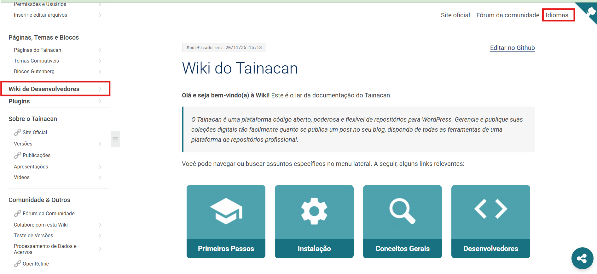
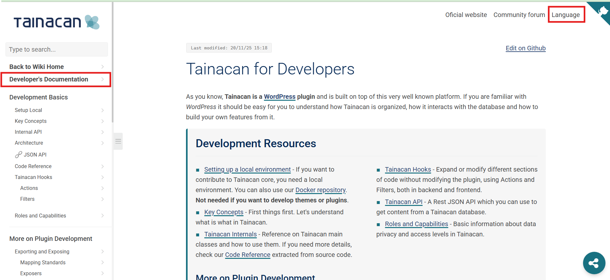
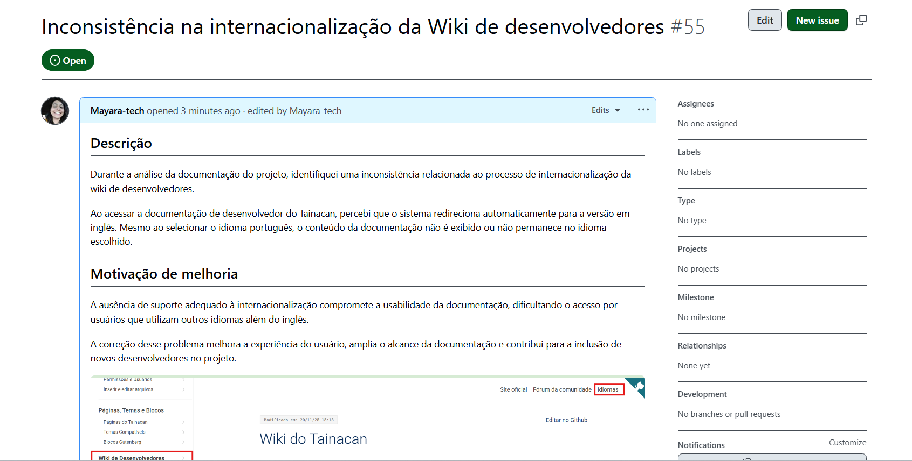

# Diário de Bordo – Sprint 0

## Informações da Sprint

| Item              | Descrição                |
|-------------------|-------------------------|
| Sprint            | Sprint 0                |
| Data de Início    | 06/04/2026              |
| Data de Término   | 20/04/2026              |
| Responsável       | Mayara Alves            |

---

## Objetivo da Sprint

A Sprint 0 teve como objetivo principal compreender o funcionamento do Tainacan, identificar suas tecnologias base e preparar o ambiente necessário para execução do sistema. Além disso, buscou-se estruturar a documentação do projeto utilizando MkDocs e organizar o repositório no GitHub para documentação do desenvolvimento da disciplina.

---

## Planejamento da Sprint

A Sprint 0 foi planejada com foco na preparação do ambiente e entendimento do projeto.

| Atividade | Status |
|----------|--------|
| Estudar o Tainacan | ✔️ |
| Analisar arquitetura | ✔️ |
| Configurar ambiente | ✔️ |
| Criar documentação | ✔️ |
| Publicar GitHub Pages | ✔️ |
| Definir issue futura | ✔️ |

---

## Ferramentas e Tecnologias utilizadas na sprint

Durante a Sprint, foram utilizadas ferramentas voltadas tanto para desenvolvimento quanto para documentação e versionamento.

### Ambiente de Desenvolvimento

| Ferramenta | Finalidade |
|-----------|-----------|
| GitHub | Hospedagem do repositório |
| VSCode | Desenvolvimento e edição |
| Python | Execução do MkDocs |
| MkDocs | Geração da documentação |

---

## Execução do Tainacan (Ambiente Local)

Para executar o Tainacan localmente, foi necessário entender sua estrutura e dependências.

#### Requisitos do Sistema

| Requisito | Descrição |
|----------|----------|
| Servidor Web | Apache ou Nginx |
| Linguagem | PHP |
| Banco de Dados | MySQL ou MariaDB |
| CMS | WordPress instalado |
| Plugin | Tainacan ativo |

---

## Definição da Issue de trabalho 

Durante a análise do projeto, optei por sugerir uma nova issue em vez de selecionar uma já existente, com base em um problema que identifiquei na documentação.

Ao acessar a documentação de desenvolvedor do Tainacan, percebi que ela está disponível apenas em inglês. Quando altero o idioma para português, o conteúdo simplesmente não é exibido e volta para a tela inicial.

Na minha análise, isso indica uma falha no processo de internacionalização (i18n), possivelmente relacionada à ausência de tradução ou à falta de um mecanismo de fallback de idioma.

A issue foi registrada no repositório oficial da documentação do projeto, permitindo que a equipe de desenvolvimento avalie e, se necessário, implemente a correção ou aceite minha proposta de correção.

[Link da issue](https://github.com/tainacan/tainacan-wiki/issues/55)

### Evidência

 

  

---

## Aprendizados e Dificuldades

Durante a Sprint 0, a principal dificuldade que tive foi conseguir rodar o repositório do Tainacan localmente. No início, tive alguns problemas com a configuração do ambiente e com as dependências necessárias, o que dificultou a execução do sistema. Foi preciso testar algumas alternativas e ajustar configurações até conseguir fazer tudo funcionar corretamente.

Apesar disso, esse processo trouxe um aprendizado importante. Consegui entender melhor como funciona a configuração de um ambiente de desenvolvimento na prática. Também passei a compreender melhor a estrutura do Tainacan e como ele se integra ao WordPress.

No geral, mesmo com a dificuldade inicial, a Sprint 0 foi importante para ganhar mais segurança e preparar o ambiente para as próximas etapas do projeto.

---

## Atividades Realizadas

| Atividade                                              | Tipo          | Referência                     | Status      |
|--------------------------------------------------------|--------------|--------------------------------|-------------|
| Estudo da documentação do Tainacan                     | Estudo        | Documentação oficial           | Concluído   |
| Levantamento de requisitos do sistema                  | Análise       | Documentação / Sistema         | Concluído   |
| Clonagem do repositório do Tainacan                    | Configuração  | GitHub                         | Concluído   |
| Configuração do ambiente local (WordPress + Tainacan)  | Configuração  | Ambiente local                 | Concluído   |
| Execução inicial do repositório                        | Teste         | Ambiente local                 | Concluído   |
| Exploração prática do sistema                          | Teste         | Interface do sistema           | Concluído   |
| Levantamento das tecnologias utilizadas                | Estudo        | Código / Documentação          | Concluído   |
| Configuração do GitHub Pages                           | Configuração  | GitHub Pages                   | Concluído   |
| Deploy da documentação com MkDocs                      | Deploy        | mkdocs gh-deploy               | Concluído   |
| Publicação do site no GitHub Pages                     | Deploy        | Repositório do projeto         | Concluído   |
| Pesquisa de issues no repositório oficial              | Análise       | GitHub Issues                  | Concluído   |
| Definição da issue a ser trabalhada na Sprint 1        | Planejamento  | GitHub                         | Concluído   |

---

## Resultados Obtidos

Ao final da Sprint 0, consegui organizar bem a base do projeto e deixar o ambiente preparado para os próximos passos. Durante esse processo, configurei e executei o Tainacan localmente, o que me ajudou bastante a entender como o sistema funciona na prática. Também organizei a documentação e fiz a publicação no GitHub Pages, o que facilitou visualizar melhor o andamento do projeto.

Além disso, consegui compreender melhor a arquitetura do sistema e identificar os principais requisitos técnicos necessários para sua execução. Também ajustei a organização do repositório, deixando tudo mais claro para continuar o desenvolvimento. Com isso, defini a issue que será trabalhada na Sprint 1, já com uma direção mais objetiva para a próxima Sprint.

---

## Histórico de Versões

| Versão |    Data    | Descrição |            Autor(es)            |
| :----: | :--------: | :-------: | :-----------------------------: |
| `1.0`  | 20/04/2026 |   Criação do Diário de bordo    | [Mayara Alves](https://github.com/mayara-tech) |
