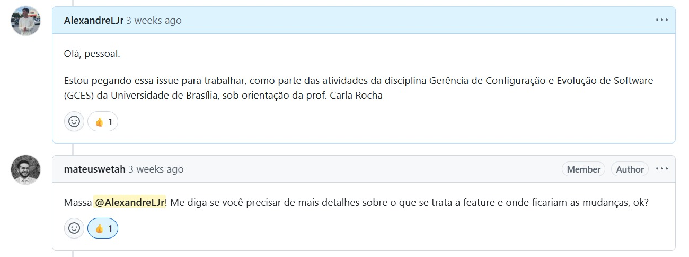
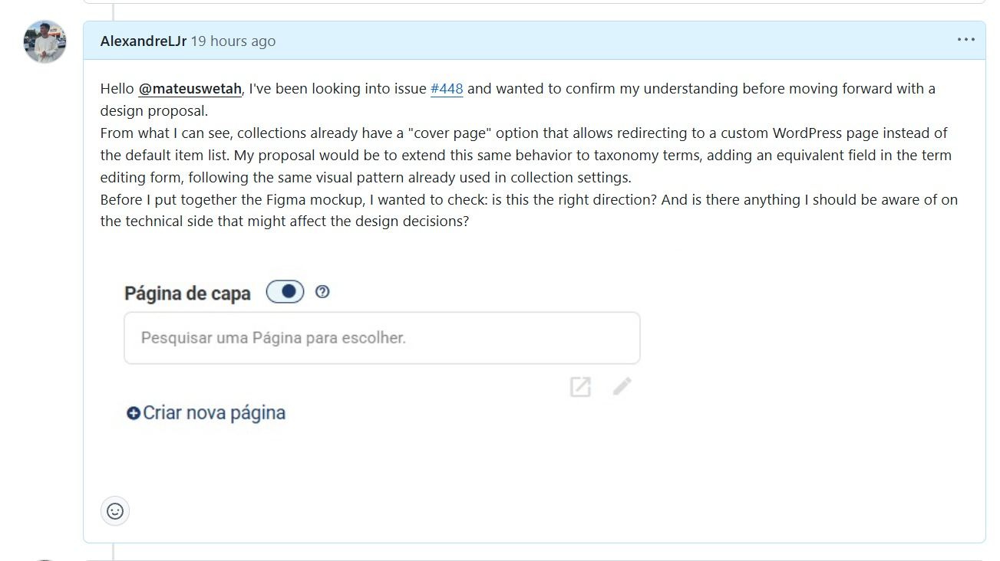
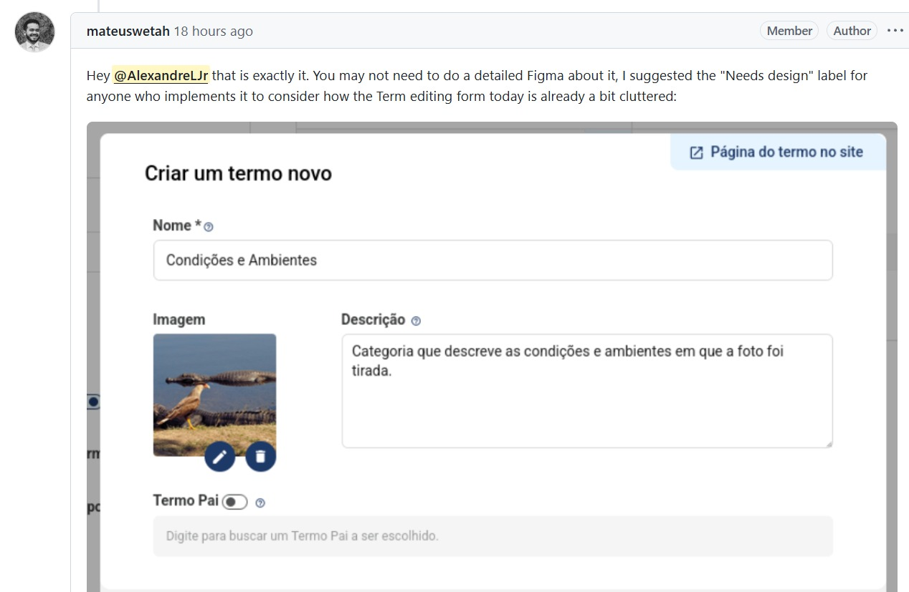
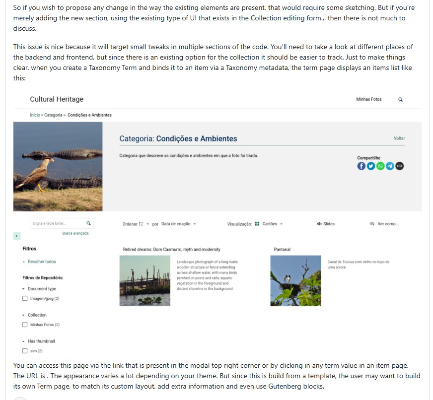

# Diário de Bordo - Alexandre Lema Junior

---

## Resumo da Sprint

Após a análise das possibilidades apresentadas na sprint anterior, foi realizada a escolha da Issue [**#448– Term "cover page"**](https://github.com/tainacan/tainacan/issues/448) como foco da contribuição individual.

A issue propõe a criação de uma funcionalidade que permita associar páginas personalizadas do WordPress a termos de taxonomias, comportamento semelhante ao já existente para coleções através da funcionalidade "Cover Page".

Inicialmente, a presença da label "Needs Design" levou à interpretação de que a contribuição seria predominantemente relacionada à UX/UI. Entretanto, após uma discussão com Mateus Wetah, colaborador do Tainacan, foi possível compreender melhor o escopo da demanda e perceber que a solução envolve mais do que uma proposta visual.

Esse diálogo alterou significativamente a estratégia inicialmente planejada, direcionando o trabalho para uma análise mais ampla da funcionalidade existente e de como ela pode ser adaptada para atender aos requisitos da issue.

A resposta recebida confirmou que a funcionalidade desejada deve seguir a mesma lógica já utilizada pela opção "Cover Page" das coleções, reduzindo a necessidade de prototipação e direcionando o trabalho para a análise da implementação existente.

---

## Atividades Realizadas

| Atividade                                                         | Tipo         | Referência        | Status    |
| ----------------------------------------------------------------- | ------------ | ----------------- | --------- |
| Escolha da contribuição principal                                 | Planejamento | Issue [**#448**](https://github.com/tainacan/tainacan/issues/448)        | Concluído |
| Registro de interesse na issue                                    | Comunicação  | GitHub Issue [**#448**](https://github.com/tainacan/tainacan/issues/448) | Concluído |
| Leitura detalhada da descrição da issue                           | Análise      | GitHub Issue [**#448**](https://github.com/tainacan/tainacan/issues/448) | Concluído |
| Investigação inicial da funcionalidade proposta                   | Estudo       | Tainacan          | Concluído |
| Contato com colaborador do projeto para validação do entendimento | Comunicação  | GitHub Comments   | Concluído |
| Discussão sobre escopo e requisitos da solução                    | Comunicação  | GitHub Comments   | Concluído |
| Reavaliação da estratégia de contribuição                         | Planejamento | Issue [**#448**](https://github.com/tainacan/tainacan/issues/448)        | Concluído |

---

## Maiores Avanços

### Escolha definitiva da contribuição

Foi selecionada a Issue [**#448**](https://github.com/tainacan/tainacan/issues/448) como foco principal do trabalho, permitindo direcionar os estudos e esforços para uma demanda específica do projeto.

### Validação do entendimento da issue

Através da interação com Mateus, foi possível confirmar o objetivo da funcionalidade e compreender melhor o comportamento esperado pela comunidade.

### Redefinição da estratégia de trabalho

A discussão revelou que a issue não exige necessariamente uma proposta completa de UX/UI, mas sim uma análise da funcionalidade já existente para coleções e sua adaptação para páginas de termos.

---

## Maiores Dificuldades

### Interpretação inicial incorreta da demanda

A presença da label "Needs Design" levou à expectativa de que a contribuição seria focada principalmente em interface e prototipação.

Após o retorno do colaborador, tornou-se evidente que o principal desafio está relacionado ao entendimento da funcionalidade existente e da forma como ela pode ser expandida para outro contexto dentro do sistema.

### Necessidade de aprofundamento técnico

Mesmo sendo uma issue inicialmente identificada como relacionada à experiência do usuário, sua implementação exige compreender elementos da arquitetura do Tainacan e da integração com páginas do WordPress.

---

## Aprendizados

### A importância da validação de requisitos

Mesmo após a leitura detalhada da issue, algumas interpretações podem não refletir exatamente a intenção dos mantenedores. O contato direto com a comunidade ajuda a evitar retrabalho.

### Labels não definem completamente uma demanda

Uma issue marcada como necessidade de design pode envolver requisitos funcionais e arquiteturais que vão além da interface.

### Comunicação é parte fundamental da contribuição

As discussões realizadas com os colaboradores foram essenciais para alinhar expectativas e definir um caminho de desenvolvimento mais adequado.

---

## Plano Pessoal para a Próxima Sprint

* Investigar onde a funcionalidade "Cover Page" está implementada atualmente;
* Mapear os componentes envolvidos na solução existente;
* Definir uma proposta de implementação alinhada às orientações recebidas;
* Iniciar o desenvolvimento da contribuição;
* Continuar acompanhando a discussão da issue junto aos mantenedores.

---

## Histórico de Versões

| Versão |    Data    |                Descrição               |     Autor(es)    |
| :----: | :--------: | :------------------------------------: | :--------------: |
|  `1.0` | 17/06/2026 | Criação do Diário de Bordo da Sprint 4 | [Alexandre Junior](https://github.com/AlexandreLJr) |
