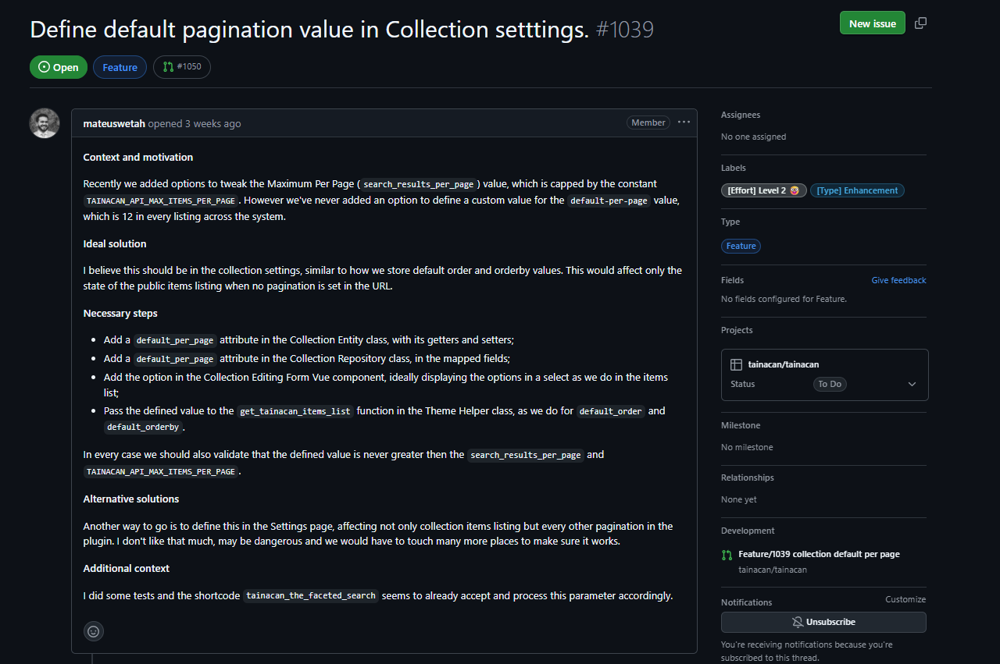
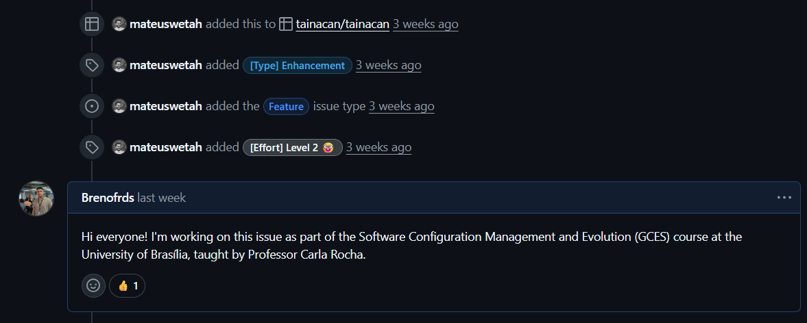

# Diário de Bordo – Sprint 4

## Informações da Sprint

| Item            | Descrição              |
|-----------------|------------------------|
| Sprint          | Sprint 4               |
| Data de Início  | 27/05/2026             |
| Data de Término | 08/06/2026             |
| Responsável     | Breno Soares Fernandes |

---

## Objetivo da Sprint

Após o alinhamento da equipe com o mantenedor do Tainacan, ficou entendido que não havia
issues "prontas" suficientes para todos, sendo necessário investigar o repositório oficial em
busca de uma oportunidade de contribuição adequada ao nível de cada um. Meu objetivo pessoal
nesta sprint foi **escolher e assumir formalmente uma issue** no repositório oficial do
Tainacan, entendendo o seu escopo antes de partir para a implementação (que ficou planejada
para a Sprint 5).

---

## Planejamento e Atividades da Sprint

Direcionei a investigação para issues abertas no repositório oficial
[`tainacan/tainacan`](https://github.com/tainacan/tainacan/issues), priorizando uma tarefa que
fosse de complexidade compatível com a entrada no projeto, mas que ainda tocasse partes
relevantes do sistema (backend e frontend), para um aprendizado mais completo.

| Atividade | Status |
|-----------|--------|
| Investigar issues abertas no repositório oficial | ✔️ |
| Escolher uma issue adequada ao nível e ao escopo desejado | ✔️ |
| Manifestar interesse na issue (comentário declarando intenção) | ✔️ |
| Obter confirmação do mantenedor para assumir a tarefa | ✔️ |
| Entender o escopo técnico da issue antes de implementar | ✔️ |

---

## Ferramentas e Tecnologias Utilizadas

| Ferramenta / Tecnologia | Finalidade |
|-------------------------|------------|
| **GitHub (Issues)** | Investigação, escolha e reserva da issue no repositório oficial |
| **Navegador** | Leitura da issue, do código referenciado e da documentação |

---

## Atividades Realizadas em Detalhes

**1. Investigação e escolha da issue**

Após explorar as issues abertas do repositório oficial, escolhi a issue
[**#1039 – Define default pagination value in Collection settings**](https://github.com/tainacan/tainacan/issues/1039),
classificada como *Feature* / *[Effort] Level 2*. A issue propõe permitir que cada coleção
defina o **número padrão de itens por página** na listagem pública — hoje fixo em 12 no
sistema inteiro.

Os motivos da escolha:
- **Nível adequado** (Level 2): não é trivial, mas é factível para um primeiro ciclo.
- **Escopo completo**: toca **backend** (entidade, repositório, API) e **frontend** (Vue),
  oferecendo um bom panorama da arquitetura do Tainacan.
- **Padrão claro a seguir**: a própria issue indica imitar o comportamento já existente de
  `default_order` / `default_orderby`, reduzindo a ambiguidade.

**2. Manifestação de interesse e confirmação do mantenedor**

Comentei na issue declarando minha intenção de trabalhar nela no contexto da disciplina de
GCES (UnB, Prof.ª Carla Rocha). O mantenedor **mateuswetah** reagiu ao comentário com um
👍, sinalizando que eu poderia assumir a tarefa — etiqueta comum em projetos open-source para
"reservar" uma issue e evitar trabalho duplicado.

**3. Entendimento do escopo**

Antes de codar, estudei os passos descritos pelo autor da issue (adicionar o atributo
`default_per_page` na entidade e no repositório da coleção, expor a opção no formulário Vue de
edição, e passar o valor para a função `get_tainacan_items_list` do Theme Helper), além da
regra de validação (o valor nunca pode exceder o máximo de itens por página). Esse entendimento
foi a base para o planejamento técnico da implementação na Sprint 5.

---

## Aprendizados e Dificuldades

**Maiores Dificuldades:**

- Escolher, entre várias issues abertas, uma que equilibrasse complexidade adequada e
  aprendizado relevante.
- Compreender o escopo técnico de uma issue em uma base de código grande e desconhecida antes
  de começar a implementar.

**Aprendizados:**

- A **etiqueta de contribuição em open-source**: manifestar interesse e aguardar a confirmação
  do mantenedor antes de assumir uma issue.
- A importância de **entender o "o quê" e o "porquê"** de uma demanda antes de escrever qualquer
  código, reduzindo retrabalho.
- Como navegar pelas issues e pela organização de um projeto open-source real (labels de tipo e
  de esforço, fluxo de status no board do projeto).

---

## Próximos Passos (Sprint 5)

- Preparar o ambiente local de desenvolvimento para rodar o código do repositório.
- Implementar a feature da issue #1039 (backend + frontend + testes).
- Validar a solução e abrir a Pull Request no repositório oficial.

---

## Histórico de Versões

| Versão | Data | Descrição | Autor |
| :----: | :--: | :-------- | :---- |
| `1.0` | 16/06/2026 | Criação do Diário de Bordo da Sprint 4 | [Breno Soares Fernandes](https://github.com/Brenofrds) |
