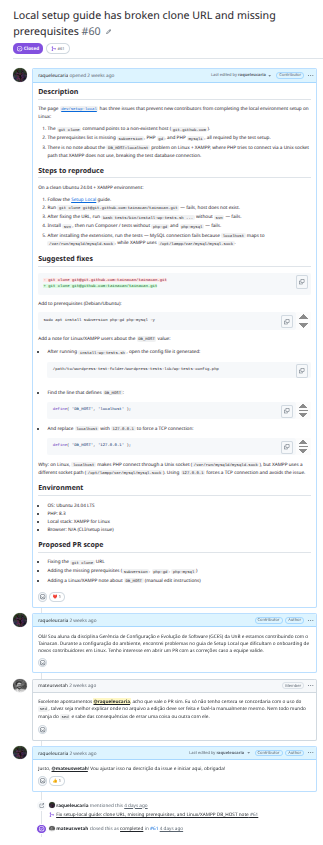
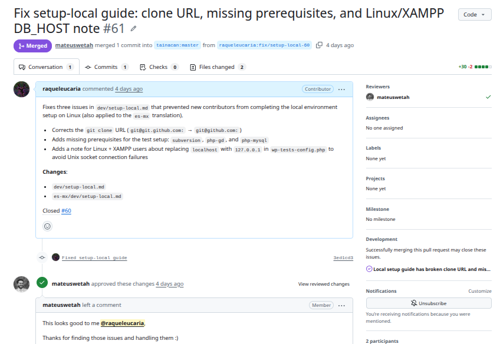

# Diário de Bordo – Sprint 4

## Informações da Sprint

| Item              | Descrição                |
|-------------------|-------------------------|
| Sprint            | Sprint 4                |
| Data de Início    | 27/05/2026              |
| Data de Término   | 08/06/2026	          |
| Responsável       | Raquel Eucaria          |

---

## Objetivo da Sprint

Após reunião com o Matheus, foi entendido que não haveria issues suficientes disponíveis no repositório oficial. Dessa forma, ficou definido que precisaríamos realizar uma investigação de melhorias e bugs nos repositórios para identificar oportunidades de contribuição. Meu objetivo pessoal nesta sprint foi, a partir dessa investigação, levantar e corrigir uma falha de documentação, abrindo a issue correspondente e ajustando o documento referente.

---

## Planejamento e Atividades da Sprint

Levando em conta as dificuldades e problemas enfrentados na documentação de configuração de ambiente (mapeados na [Sprint 0](../Sprint-0/Sprint_0_Dificuldades.md)), direcionei meus esforços para corrigir essa lacuna no repositório oficial da [wiki do Tainacan](https://github.com/tainacan/tainacan-wiki). Segui os padrões gerais da organização conforme mapeado no [Guia de Contribuição](../../Tainacan/Guia_De_Contribuicao.md): a documentação é mantida em inglês (comentários em português são permitidos, mas, visando o caráter internacional do projeto, o padrão é manter o conteúdo em inglês). Assim, ajustei tanto a documentação em inglês quanto em espanhol (doc em portugês não existe).

| Atividade | Status |
|----------|--------|
| Investigar melhorias/bugs nos repositórios | ✔️ |
| Abrir issue sobre a falha de documentação de configuração de ambiente | ✔️ |
| Ajustar a documentação em inglês e em espanhol | ✔️ |
| Submeter PR seguindo os padrões da organização | ✔️ |

---

## Ferramentas e Tecnologias Utilizadas

| Ferramenta / Tecnologia | Finalidade |
|-----------|-----------|
| **GitHub (Issues/PRs)** | Abertura da issue e submissão da PR no repositório oficial `tainacan-wiki` |
| **Git** | Versionamento das alterações na documentação |
| **Markdown** | Edição da documentação (em inglês e espanhol) |

---

## Atividades Realizadas em Detalhes

**1. Investigação de melhorias e bugs**

**2. Abertura da issue de documentação:**
Levando em conta as dificuldades e problemas na documentação de configuração de ambiente — já mapeados na [Sprint 0](../Sprint-0/Sprint_0_Dificuldades.md) —, abri a issue correspondente no repositório oficial da wiki para registrar e propor a correção: [tainacan-wiki#60](https://github.com/tainacan/tainacan-wiki/issues/60).

**3. Ajuste da documentação e PR aprovada:**
Seguindo os padrões gerais da organização conforme o [Guia de Contribuição](../../Tainacan/Guia_De_Contribuicao.md) (documentação mantida em inglês para alcance internacional), ajustei o documento de configuração de ambiente nas versões em inglês e em espanhol. A PR foi submetida e **aprovada**: [tainacan-wiki#61](https://github.com/tainacan/tainacan-wiki/pull/61).

---

## Aprendizados e Dificuldades

**Maiores Dificuldades:**

- Escassez de issues disponíveis no repositório, exigindo uma investigação ativa de melhorias e bugs para encontrar uma contribuição relevante.
- Garantir a consistência entre as versões em inglês e em espanhol da documentação, mantendo o padrão internacional da organização.

**Aprendizados:**

- Como conduzir uma investigação de melhorias/bugs em um projeto open-source quando não há demandas pré-definidas.
- Aplicação prática dos padrões de contribuição da organização (idioma, fluxo de issue → PR) mapeados no Guia de Contribuição.
- A importância de transformar dificuldades reais enfrentadas pela equipe (como o setup de ambiente) em contribuições concretas para a comunidade.

---

## Próximos Passos (Sprint 5)

- Investigar outras melhorias/bugs
- Realizar a solução

---

## Histórico de Versões

| Versão |    Data    | Descrição |            Autor(es)            |
| :----: | :--------: | :-------: | :-----------------------------: |
| `1.0`  | 11/06/2026| Criação do Diário de Bordo | [Raquel Eucaria](https://github.com/raqueleucaria) |
