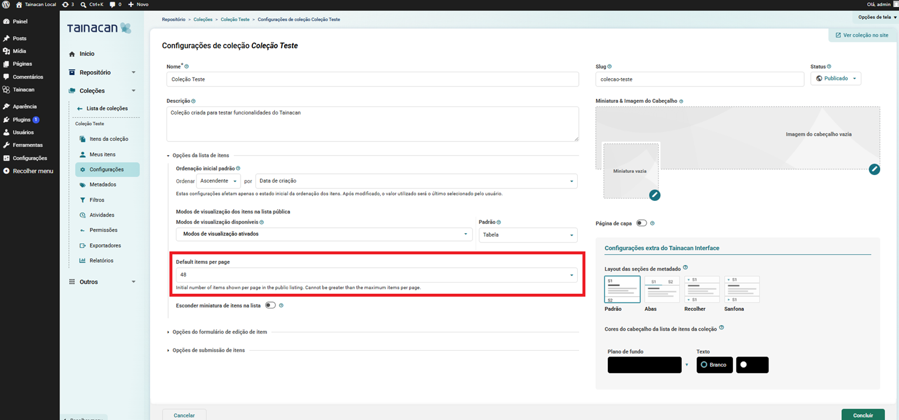
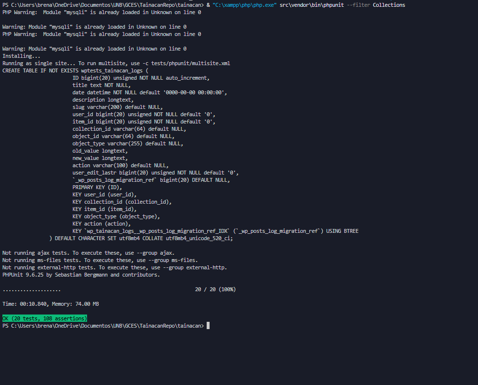
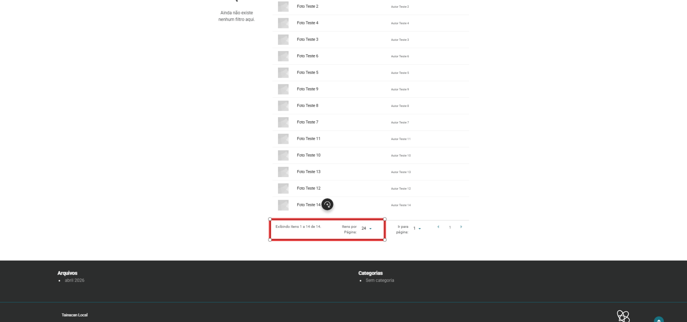
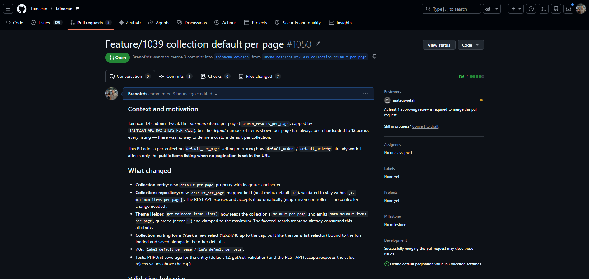
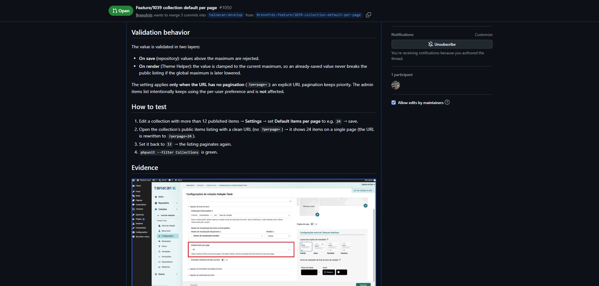
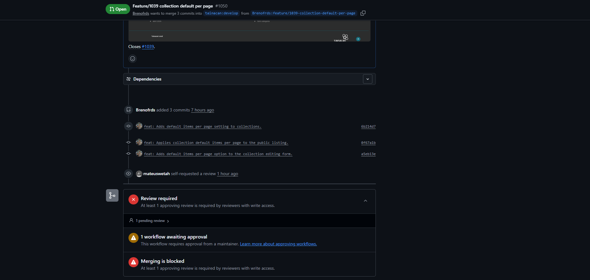

# Diário de Bordo – Sprint 5

## Informações da Sprint

| Item            | Descrição              |
|-----------------|------------------------|
| Sprint          | Sprint 5               |
| Data de Início  | 10/06/2026             |
| Data de Término | 24/06/2026             |
| Responsável     | Breno Soares Fernandes |

---

## Objetivo da Sprint

Implementar a feature da issue [**#1039 – Define default pagination value in Collection
settings**](https://github.com/tainacan/tainacan/issues/1039), assumida na Sprint 4. O objetivo
foi permitir que cada coleção defina o **número padrão de itens por página** exibido na sua
listagem pública (hoje fixo em 12 no sistema), preparando o ambiente de desenvolvimento,
implementando a solução (backend, frontend e testes), validando ponta a ponta e abrindo a
Pull Request no repositório oficial.

---

## Planejamento e Atividades da Sprint

A implementação foi conduzida em etapas pequenas e commitáveis, seguindo o entendimento
técnico construído a partir da própria issue (que indicava imitar o comportamento já existente
de `default_order` / `default_orderby`).

| Atividade | Status |
|-----------|--------|
| Preparar o ambiente local para rodar o **código do repositório** (não a versão da loja) | ✔️ |
| Configurar a suíte de testes automatizados (PHPUnit) | ✔️ |
| Implementar o backend (entidade + repositório + validação) | ✔️ |
| Aplicar o valor na listagem pública (Theme Helper) | ✔️ |
| Implementar a opção no formulário de edição da coleção (Vue) + i18n | ✔️ |
| Validar a solução ponta a ponta (admin + interface pública) | ✔️ |
| Abrir a Pull Request no repositório oficial | ✔️ |

---

## Ferramentas e Tecnologias Utilizadas

| Ferramenta / Tecnologia | Finalidade |
|-------------------------|------------|
| **XAMPP (Apache + MySQL)** | Servidor local para rodar o WordPress |
| **WordPress + plugin Tainacan** | Plataforma e plugin alvo da contribuição |
| **PHP / Composer** | Backend do plugin e dependências |
| **Node.js / npm / Webpack / Vue 3** | Build e desenvolvimento do frontend |
| **PHPUnit** | Testes automatizados |
| **Git / GitHub** | Versionamento e abertura da PR |
| **VS Code** | Edição de código |

---

## Atividades Realizadas em Detalhes

### 1. Preparação do ambiente de desenvolvimento

O primeiro desafio foi fazer o WordPress rodar **o código do repositório** (versão de
desenvolvimento) em vez do plugin instalado pela loja. Isso envolveu instalar as dependências
(Composer e npm), compilar os assets (Webpack + SASS) e implantar o resultado na instalação
local do WordPress.

Alguns obstáculos do ambiente Windows foram resolvidos:
- Habilitar a extensão **`gd`** do PHP (necessária para processamento de imagens);
- Instalar as dependências PHP contornando uma exigência de versão (o projeto pede PHP 8.3 em
  um pacote de exportação XLSX, e o ambiente tinha 8.2);
- Como o `rsync` (usado pelo script de build oficial) não existe no Git Bash do Windows, a
  implantação foi feita com **`robocopy`**.

Também configurei a **suíte de testes do WordPress (PHPUnit)** em um banco de dados dedicado,
para conseguir rodar e escrever testes automatizados localmente.

### 2. Entendimento técnico da solução

Antes de codar, mapeei como a feature deveria se encaixar na arquitetura do Tainacan:
- **Entidade `Collection`** e **Repositório**: onde as configurações da coleção (como ordem
  padrão) são declaradas e persistidas;
- **Theme Helper**: monta a listagem pública e já repassa atributos `data-*` para o frontend;
- **Formulário Vue de edição da coleção**: onde o administrador define as opções.

Um ponto importante que descobri: o frontend da busca facetada **já sabia receber** um valor de
itens por página — faltava o backend **gerar** esse valor a partir da configuração da coleção.

### 3. Implementação do backend (entidade + repositório + validação)

- Adicionei o atributo **`default_per_page`** na entidade `Collection`, com getter e setter.
- Registrei o campo no repositório como metadado da coleção, com **valor padrão 12** e
  **validação** para garantir que o valor nunca ultrapasse o máximo de itens por página
  (`search_results_per_page` / `TAINACAN_API_MAX_ITEMS_PER_PAGE`).
- A API REST passou a aceitar e expor o campo **automaticamente** (o controller é dirigido pelo
  mapeamento de campos do repositório), sem necessidade de alterá-lo.

### 4. Aplicação do valor na listagem pública (Theme Helper)

Ajustei a função `get_tainacan_items_list` para **ler o `default_per_page` da coleção** e
repassá-lo ao frontend (atributo `data-default-items-per-page`), com duas proteções: nunca
emitir um valor inválido e **limitar ao teto** (clamp), garantindo que a listagem nunca quebre
mesmo que o máximo global seja reduzido depois.

### 5. Implementação do frontend (formulário de edição + i18n)

No formulário de edição da coleção, adicionei um **campo de seleção (select)** "Default items
per page" com as opções 12/24/48 e o teto (montadas dinamicamente, como na listagem de itens),
ligado ao estado do formulário (carregar o valor salvo e enviar ao salvar). Também adicionei os
textos traduzíveis (i18n).

### 6. Testes automatizados

Escrevi testes **PHPUnit** cobrindo:
- a entidade (valor padrão 12, gravar/ler o valor, e a validação que bloqueia valores acima do
  teto);
- a API REST (aceitar e expor o valor; rejeitar valores acima do teto).

Os testes passaram com sucesso, sem regressões na suíte de coleções.

### 7. Validação ponta a ponta

Para validar de verdade, criei uma coleção de teste com 14 itens e:
- defini o padrão como **24** nas configurações → a listagem pública passou a mostrar todos os
  itens em uma página só (a URL foi reescrita para `?perpage=24`);
- repeti com **48**, confirmando o comportamento;
- confirmei que, **com paginação explícita na URL** (`?perpage=`), esta tem prioridade — exatamente
  como a issue pede ("apenas quando não há paginação na URL");
- confirmei também que a listagem **do admin** continua usando a preferência pessoal do usuário
  (e não o padrão da coleção), preservando o escopo da feature.

### 8. Abertura da Pull Request

Abri a Pull Request [**#1050**](https://github.com/tainacan/tainacan/pull/1050) contra a branch
`develop`, seguindo o padrão do projeto (texto em inglês, narrativo: contexto, o que mudou,
comportamento da validação, como testar e evidências), com `Closes #1039`. O mantenedor
**mateuswetah** se atribuiu como revisor.

---

## Aprendizados e Dificuldades

**Maiores Dificuldades:**

- Configurar o ambiente de desenvolvimento e a suíte de testes em **Windows**, contornando
  ferramentas ausentes (`rsync`, `svn`) e exigências de versão do PHP.
- Entender uma **base de código grande e desconhecida** o suficiente para implementar uma
  alteração cirúrgica sem quebrar funcionalidades existentes.
- Lidar com a parte de **frontend (Vue)**, garantindo que o valor salvo fosse carregado e
  exibido corretamente no formulário.

**Aprendizados:**

- A **arquitetura do Tainacan**: entidade → repositório → API REST → Theme Helper → frontend
  Vue, e como uma configuração de coleção percorre essas camadas.
- A importância de **imitar padrões existentes** (`default_order`/`default_orderby`) para manter
  consistência e reduzir risco.
- O valor de **testes automatizados** e de uma **validação manual ponta a ponta** antes de
  abrir a PR.
- O **fluxo completo de contribuição open-source**: fork, branch, commits no padrão do projeto,
  e PR com descrição autossuficiente para o revisor.

---

## Próximos Passos

- Aguardar a revisão do mantenedor na PR #1050.
- Caso sejam solicitadas alterações, aplicá-las na mesma branch e atualizar a PR.

---

## Histórico de Versões

| Versão | Data | Descrição | Autor |
| :----: | :--: | :-------- | :---- |
| `1.0` | 16/06/2026 | Criação do Diário de Bordo da Sprint 5 | [Breno Soares Fernandes](https://github.com/Brenofrds) |
