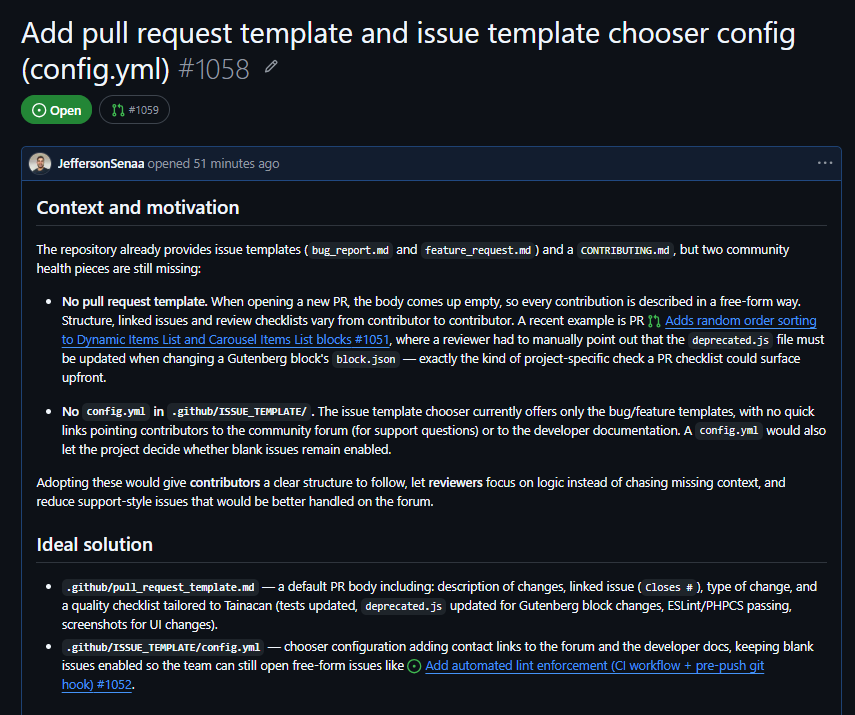
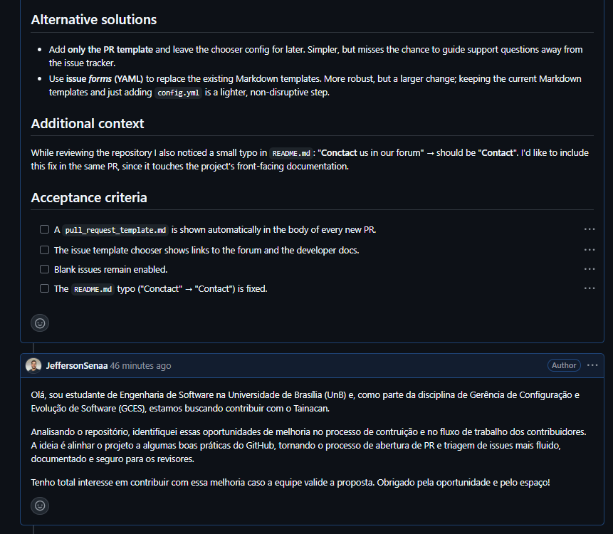

# Diário de Bordo – Sprint 5

## Informações da Sprint

| Item            | Descrição                  |
|-----------------|----------------------------|
| Sprint          | Sprint 5                   |
| Data de Início  | 10/06/2026                 |
| Data de Término | 24/06/2026                 |
| Responsável     | Jefferson Sena Oliveira    |

---

## Objetivo da Sprint

Identificar uma oportunidade de contribuição voltada à **community health** do repositório oficial do Tainacan, documentar os problemas encontrados em uma issue bem estruturada e submeter o PR com a implementação da solução.

A investigação do repositório revelou a ausência de dois recursos que facilitam a padronização de contribuições:

1. **Template de Pull Request** — PRs eram submetidas sem estrutura, sem seção de descrição, tipo de mudança ou checklist de qualidade.
2. **Arquivo de configuração do seletor de issue templates (`config.yml`)** — o chooser de issues não direcionava contribuidores ao fórum da comunidade nem à documentação para desenvolvedores.
3. **Typo no README.md** — a palavra "Conctact" (deveria ser "Contact") estava presente no arquivo.

Esses problemas foram formalizados na [**issue #1058**](https://github.com/tainacan/tainacan/issues/1058) e resolvidos no [**PR #1059**](https://github.com/tainacan/tainacan/pull/1059).

---

## Planejamento e Atividades da Sprint

| Atividade | Status |
|-----------|--------|
| Explorar o repositório oficial para identificar lacunas de _community health_ | ✔️ |
| Estudar a documentação do GitHub sobre PR templates e `ISSUE_TEMPLATE/config.yml` | ✔️ |
| Abrir a issue [**#1058**](https://github.com/tainacan/tainacan/issues/1058) documentando os problemas e propondo a solução | ✔️ |
| Criar a branch `feature/pr-template-and-issue-config` | ✔️ |
| Implementar `.github/pull_request_template.md` | ✔️ |
| Implementar `.github/ISSUE_TEMPLATE/config.yml` | ✔️ |
| Corrigir typo no README.md (`"Conctact"` → `"Contact"`) | ✔️ |
| Abrir PR [**#1059**](https://github.com/tainacan/tainacan/pull/1059) no repositório oficial | ✔️ |

> Legenda de status: ⬜ Pendente · 🔄 Em andamento · ✔️ Concluído

---

## Ferramentas e Tecnologias Utilizadas

| Ferramenta / Tecnologia | Finalidade |
|-------------------------|------------|
| **Git / GitHub (Issues e Pull Requests)** | Versionamento, abertura da issue e submissão do PR |
| **Documentação GitHub (_community health files_)** | Referência para estrutura de PR templates e `config.yml` |
| **VS Code** | Edição dos arquivos de template e configuração |

---

## Atividades Realizadas em Detalhes

### 1. Exploração do repositório e identificação dos problemas

A investigação começou pela pasta `.github/` do repositório. O Tainacan já possuía templates para issues (pasta `ISSUE_TEMPLATE/`), mas não tinha nenhum template de Pull Request — o que significa que todas as PRs eram abertas com descrição completamente livre, sem guia de estrutura para o contribuidor.

Também faltava o arquivo `ISSUE_TEMPLATE/config.yml`, que configura o seletor de issue templates. Sem ele, o chooser não direcionava contribuidores a recursos alternativos (fórum da comunidade, documentação para desenvolvedores), tornando issues de suporte e dúvidas mais frequentes no tracker de bugs.

Durante a leitura do `README.md`, identifiquei ainda um typo na seção de contato: a palavra `"Conctact"` no lugar de `"Contact"`.

### 2. Estudo da documentação do GitHub (_community health files_)

Para implementar a solução corretamente, estudei a documentação oficial do GitHub sobre:

- **PR templates**: como criar `.github/pull_request_template.md`, quais seções são esperadas (descrição da mudança, issue vinculada, tipo de alteração, checklist de qualidade) e como o arquivo é carregado automaticamente em novas PRs.
- **`ISSUE_TEMPLATE/config.yml`**: estrutura do arquivo, campos `blank_issues_enabled` e `contact_links`, e como adicionar links externos (fórum, docs) que aparecem como opções no seletor de templates.

O principal desafio desta etapa foi entender a estrutura exata esperada pelo GitHub para que os arquivos funcionassem corretamente — especialmente o formato do `config.yml` e a hierarquia de campos do PR template.

### 3. Abertura da issue #1058

Antes de implementar, documentei o problema na [issue #1058](https://github.com/tainacan/tainacan/issues/1058), seguindo o padrão do projeto. A issue detalha:

- **Contexto**: o repositório já tem templates para issues, mas carece de template de PR e de configuração do chooser.
- **Problema**: PRs sem estrutura dificultam a revisão; o chooser sem `config.yml` não direciona contribuidores a recursos de suporte.
- **Solução proposta**: criação dos dois arquivos ausentes e correção do typo no README.
- **Critérios de aceitação**: template de PR exibido automaticamente em novas PRs; chooser com links para fórum e documentação; blank issues mantidos habilitados; typo corrigido.

- Imagens da Issue

### 4. Implementação dos arquivos

A implementação foi dividida em dois commits para manter o histórico limpo e rastreável:

**Commit 1 — Templates e configuração:**

- **`.github/pull_request_template.md`**: template com seções para descrição da mudança, issue vinculada, tipo de alteração (feature, bug fix, documentação, refatoração) e checklist de qualidade. O checklist inclui uma referência específica ao `deprecated.js` do Tainacan, arquivo que deve ser atualizado em modificações de Gutenberg blocks — detalhe que evita retrabalho frequente em PRs desse tipo.
- **`.github/ISSUE_TEMPLATE/config.yml`**: configuração do seletor de templates com `blank_issues_enabled: true` (preservando a abertura de issues livres) e dois `contact_links` — um para o fórum oficial da comunidade Tainacan e outro para a documentação de desenvolvimento.

**Commit 2 — Correção de typo:**

- **`README.md`**: substituição de `"Conctact"` por `"Contact"` na seção de links de contato.

### 5. Abertura do PR #1059

O [PR #1059](https://github.com/tainacan/tainacan/pull/1059) foi aberto contra a branch `develop` do repositório oficial, com título em inglês (`Add PR template and issue chooser config, fix README typo`) e referência `Closes #1058`. A descrição apresenta o contexto, as mudanças realizadas e a classificação da contribuição (documentação + correção).

Imagem do Pull Request:

---

## Aprendizados e Dificuldades

**Maiores Dificuldades:**

- **Estrutura correta dos templates do GitHub**: entender os campos reconhecidos pelo PR template e o formato exato do `config.yml` do `ISSUE_TEMPLATE` chooser exigiu leitura cuidadosa da documentação oficial — pequenos erros de indentação ou nomenclatura fazem o arquivo ser ignorado silenciosamente.
- **Calibrar o conteúdo do PR template**: definir um template genérico o suficiente para qualquer tipo de contribuição ao Tainacan, mas específico o bastante para ser realmente útil (ex: a referência ao `deprecated.js`) foi um exercício de equilíbrio.

**Aprendizados:**

- Como _community health files_ padronizam e facilitam contribuições open-source, reduzindo fricção para novos contribuidores.
- A diferença prática entre PR templates, issue templates e o arquivo `config.yml` do chooser — três mecanismos distintos do GitHub com propósitos complementares.
- Que contribuições de infraestrutura e documentação têm impacto direto no fluxo de revisão e na qualidade das PRs recebidas pelo projeto.
- A importância de abrir a issue antes do PR — mesmo para mudanças pequenas — para registrar o raciocínio e dar visibilidade à equipe mantenedora.

---

## Próximos Passos

- Aguardar a revisão dos mantenedores no PR [#1059](https://github.com/tainacan/tainacan/pull/1059).
- Caso sejam solicitadas alterações (conteúdo dos templates, estrutura do `config.yml`), aplicá-las na mesma branch e atualizar o PR.

---

## Histórico de Versões

| Versão |    Data    | Descrição                              | Autor |
| :----: | :--------: | :------------------------------------- | :---- |
| `1.0`  | 28/06/2026 | Criação do Diário de Bordo da Sprint 5 | [Jefferson Sena Oliveira](https://github.com/jeffersonsenaa) |
