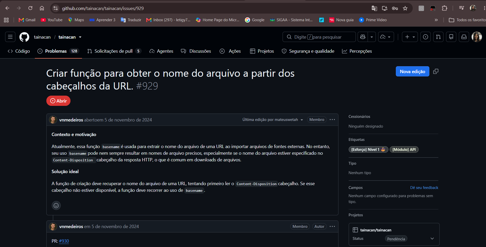
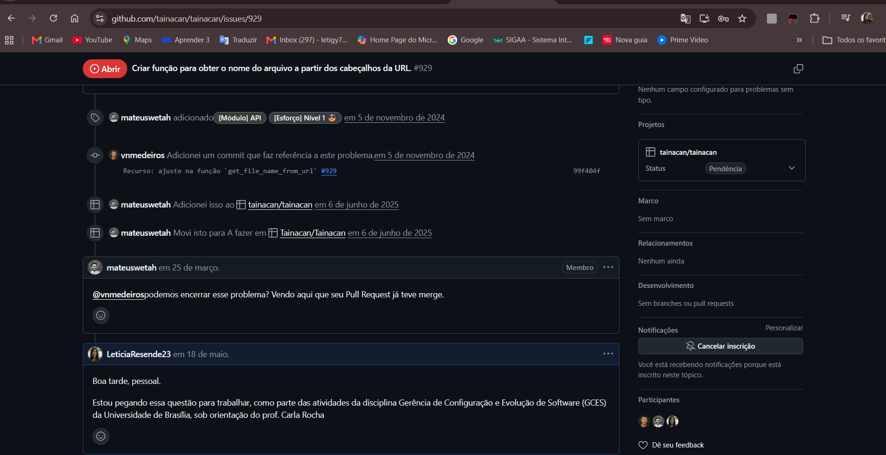
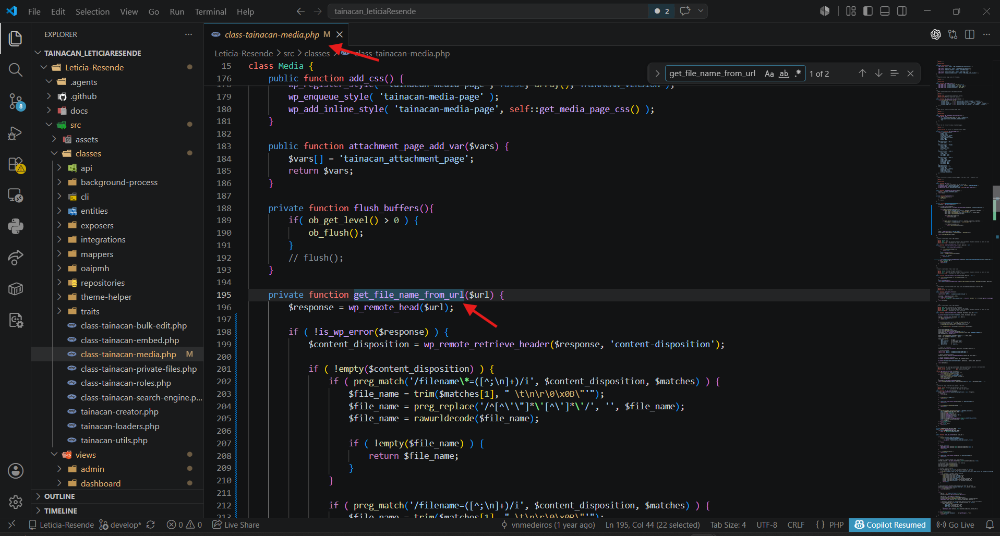
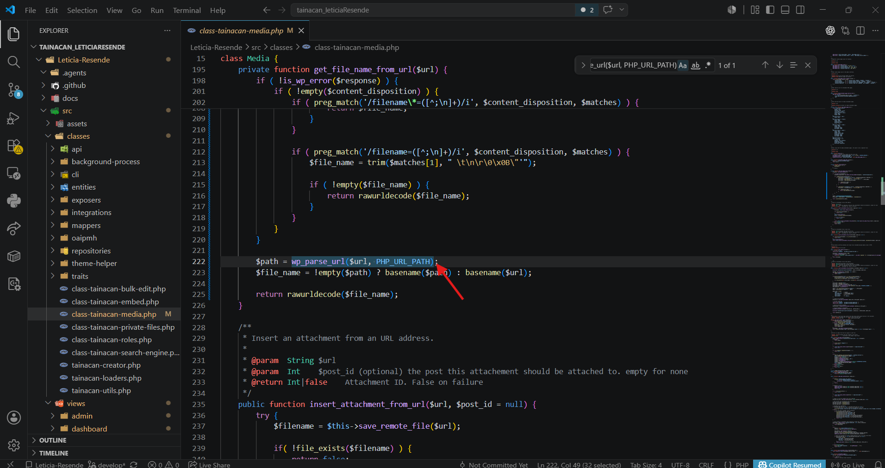
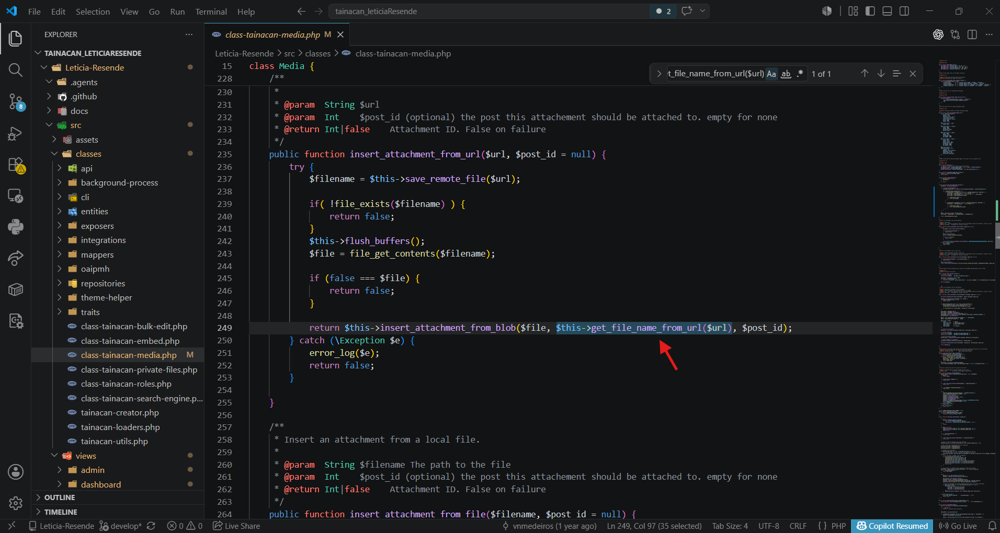
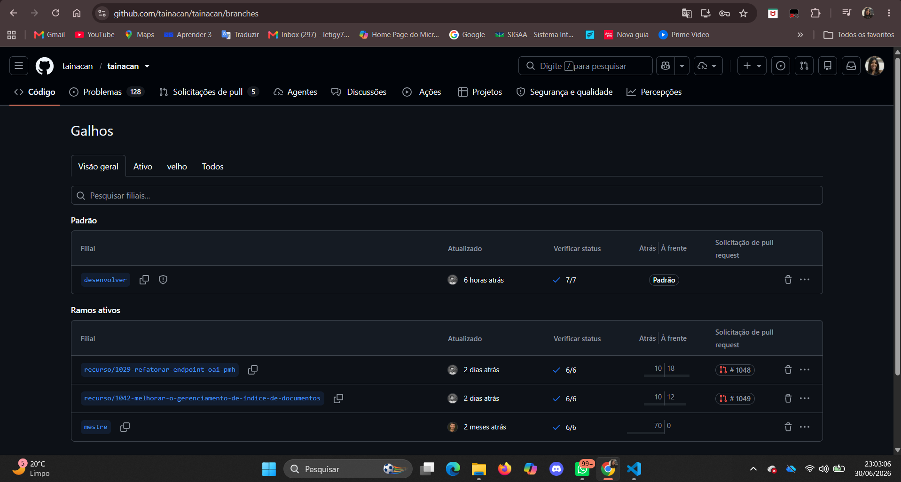

# Diário de Bordo – Letícia Resende

## Informações da Sprint

| Item | Descrição |
|---|---|
| Sprint | Sprint 5 |
| Data de Início | 10/06/2026 |
| Data de Término | 19/06/2026 |
| Responsável | Letícia Resende |
| Issue | [#929 - Criar função para obter o nome do arquivo a partir dos cabeçalhos da URL](https://github.com/tainacan/tainacan/issues/929) |
| Repositório | Tainacan |

---

## Objetivo da Sprint

O objetivo desta sprint foi implementar a Issue [#929](https://github.com/tainacan/tainacan/issues/929), relacionada ao módulo de API/mídia do Tainacan.

A issue tinha como proposta melhorar a forma como o Tainacan identifica o nome de arquivos importados a partir de URLs externas. Antes da alteração, o sistema dependia principalmente do uso de `basename()` para extrair o nome do arquivo diretamente da URL. Essa abordagem pode falhar quando a URL não contém o nome real do arquivo ou quando o arquivo é servido por uma rota de download com parâmetros.

A solução proposta foi ajustar a função responsável por obter o nome do arquivo para tentar primeiro ler o cabeçalho HTTP `Content-Disposition`, onde muitos servidores informam o nome real do arquivo. Caso esse cabeçalho não esteja disponível, a função deve continuar utilizando `basename()` como fallback.

### Issue 929

---

## Planejamento e Atividades da Sprint

Durante a sprint, foi feita a análise da issue, a localização da classe responsável pelo tratamento de arquivos de mídia e a implementação da melhoria na função `get_file_name_from_url()`.

A alteração foi realizada no arquivo:

`src/classes/class-tainacan-media.php`

A função passou a utilizar `wp_remote_head()` para consultar os cabeçalhos da URL e `wp_remote_retrieve_header()` para recuperar o cabeçalho `Content-Disposition`. Também foi mantido o fallback com `basename()`, agora utilizando `wp_parse_url()` para extrair somente o caminho da URL antes de obter o nome do arquivo.

Por falta de permissão, não foi possível criar uma branch específica para a contribuição nem realizar um fork do repositório. Assim, a implementação foi feita localmente no projeto utilizado para a atividade.

---

## Atividades Realizadas

| Atividade | Status |
|---|---|
| Leitura e interpretação da Issue #929 | Concluído |
| Localização da função `get_file_name_from_url()` | Concluído  |
| Análise do uso anterior de `basename()` | Concluído  |
| Ajuste da função para consultar o cabeçalho `Content-Disposition` | Concluído  |
| Suporte ao formato `filename=` no cabeçalho HTTP | Concluído  |
| Suporte ao formato `filename*=` com nome codificado | Concluído  |
| Manutenção do fallback com `basename()` | Concluído  |
| Uso de `wp_parse_url()` para evitar query string no nome do arquivo | Concluído  |
| Verificação do uso da função em `insert_attachment_from_url()` | Concluído  |
| Validação do diff com `git diff --check` | Concluído  |
| Tentativa de criar branch ou fork para contribuição | Não concluído por falta de permissão |

---

## Ferramentas e Tecnologias Utilizadas

| Ferramenta / Tecnologia | Finalidade |
|---|---|
| VS Code | Edição e busca visual dos arquivos do projeto |
| PHP | Linguagem principal da implementação |
| WordPress HTTP API | Uso de `wp_remote_head()` e `wp_remote_retrieve_header()` |
| Git | Verificação das alterações locais |
| GitHub Issues | Consulta da descrição e motivação da issue |
| PowerShell | Apoio para localizar arquivos e validar alterações |

---

## Atividades Realizadas em Detalhes

### 1. Análise da issue

A Issue #929 descrevia um problema no uso de `basename()` para extrair nomes de arquivos a partir de URLs externas.

O problema acontece porque algumas URLs de download não possuem o nome real do arquivo no caminho. Em muitos casos, o nome correto vem no cabeçalho HTTP `Content-Disposition`, por exemplo:

`Content-Disposition: attachment; filename="documento.pdf"`

ou:

`Content-Disposition: attachment; filename*=UTF-8''documento%20final.pdf`

Por isso, a solução ideal era consultar esse cabeçalho antes de recorrer ao `basename()`.

### 2. Localização da função responsável

Foi localizada a função:

`get_file_name_from_url()`

no arquivo:

`src/classes/class-tainacan-media.php`

Essa função já era utilizada no fluxo de importação de anexos por URL, especificamente em:

`insert_attachment_from_url()`

A chamada encontrada foi:

`$this->get_file_name_from_url($url)`

Isso confirmou que a melhoria seria aplicada no ponto correto do fluxo.

### 3. Implementação da melhoria

A função foi ajustada para:

- chamar `wp_remote_head($url)`;
- recuperar o cabeçalho `content-disposition`;
- tentar extrair o nome pelo padrão `filename*=`;
- tentar extrair o nome pelo padrão `filename=`;
- decodificar nomes com `rawurldecode()`;
- manter o fallback com `basename()`;
- usar `wp_parse_url($url, PHP_URL_PATH)` para evitar que parâmetros da URL virem parte do nome do arquivo.

Com isso, o Tainacan passa a identificar nomes de arquivos de forma mais precisa ao importar mídias de fontes externas.

### 4. Validação da alteração

A alteração foi revisada no VS Code e validada com `git diff --check`, que não apontou problemas no diff.

Não foi possível executar `php -l`, pois o comando `php` não estava disponível no PATH da máquina local.

---

## Issue Resolvida

**Função `get_file_name_from_url()` localizada em `class-tainacan-media.php`**

**Fallback com `wp_parse_url()` e `basename()`**

**Suporte aos formatos `filename*=` e `filename=`**

---

## Espaço para Print da Dificuldade com Branch/Fork

Por falta de permissão, não foi possível criar uma branch específica para subir a contribuição.

**Falha ou impossibilidade de criar branch**

---

## Aprendizados e Dificuldades

### Maiores Dificuldades

A principal dificuldade foi trabalhar sem conseguir concluir o fluxo completo de contribuição via GitHub. Por falta de permissão, não foi possível criar uma branch própria nem realizar o fork do repositório para abrir uma Pull Request.

Também houve dificuldade na validação local, pois o comando `php` não estava configurado no PATH da máquina, impossibilitando a execução de `php -l` para checagem de sintaxe.

Além disso, foi necessário localizar corretamente o arquivo responsável pela lógica da issue, já que ele não estava nas páginas administrativas em `src/views`, mas sim na camada de mídia em `src/classes`.

### Aprendizados

Foi possível compreender melhor como o WordPress trabalha com requisições HTTP por meio da WordPress HTTP API, especialmente com as funções:

`wp_remote_head()`

`wp_remote_retrieve_header()`

Também foi possível entender a importância do cabeçalho `Content-Disposition` em downloads de arquivos. Ele permite que o servidor informe o nome real do arquivo, mesmo quando a URL não contém esse nome diretamente.

Outro aprendizado importante foi a necessidade de manter fallbacks seguros. Mesmo consultando o cabeçalho HTTP, a função ainda precisa recorrer ao `basename()` quando o cabeçalho não existe ou não informa um nome válido.

---

## Próximos Passos

- Validar a funcionalidade em um ambiente WordPress com o plugin Tainacan ativo.
- Testar a importação de arquivo por URL com cabeçalho `Content-Disposition`.
- Testar também uma URL sem esse cabeçalho para confirmar o fallback com `basename()`.
- Quando houver permissão, criar uma branch específica e abrir uma Pull Request no repositório oficial.

---

## Histórico de Versões

| Versão | Data | Descrição | Autor(es) |
|---|---|---|---|
| 1.0 | 26/06/2026 | Criação do Diário de Bordo da Sprint 5 referente à Issue #929 | [Letícia Resende](https://github.com/LeticiaResende23) |
