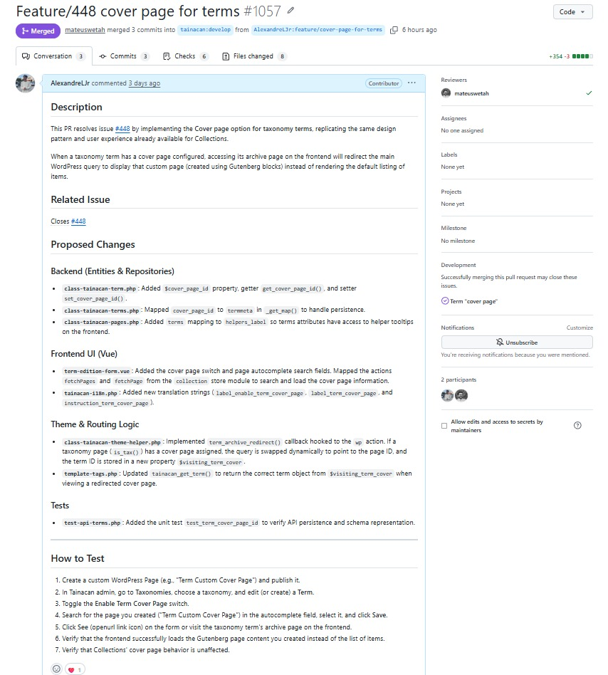
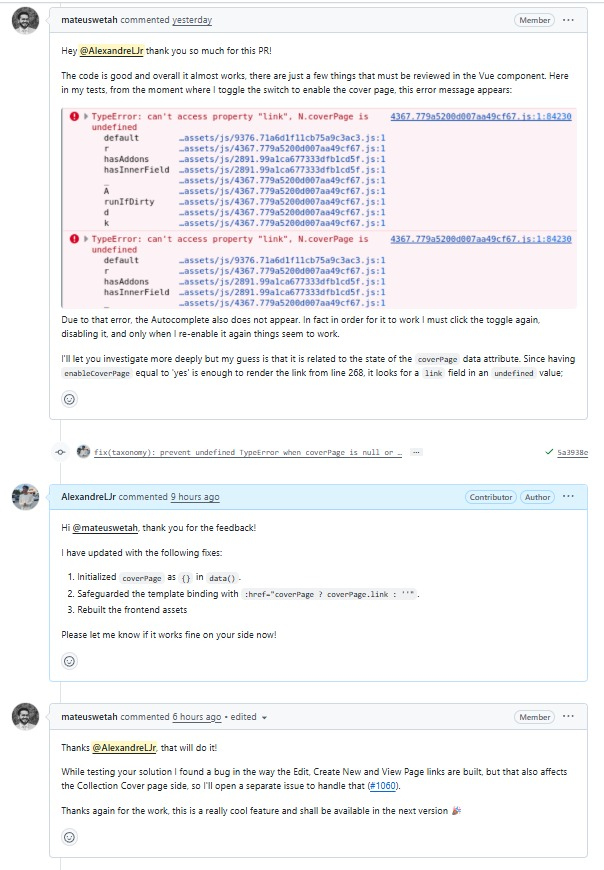

# Diário de Bordo - Alexandre Lema Junior

---

## Informações da Sprint

| Item              | Descrição                |
|-------------------|-------------------------|
| Sprint            | Sprint 6                |
| Data de Início    | 19/06/2026              |
| Data de Término   | 30/06/2026              |
| Responsável       | Alexandre Junior         |

## Resumo da Sprint

Nesta sprint, o foco principal foi a implementação e validação completa da Issue [**#448– Term "cover page"**](https://github.com/tainacan/tainacan/issues/448) no repositório oficial do Tainacan. 

O trabalho consistiu em replicar o comportamento de "Cover Page" existente para as coleções, permitindo agora que termos de taxonomia tenham páginas personalizadas do WordPress (criadas com o Gutenberg) associadas a eles. A implementação abrangeu desde a persistência de banco de dados (metadados de termos), endpoints da API REST, lógica de tema para redirecionamento das rotas, até a interface do usuário (UI) desenvolvida em Vue.js.

Após o envio da [Pull Request](https://github.com/tainacan/tainacan/pull/1057) inicial, o revisor do projeto encontrou um problema reativo no formulário do Vue que impedia a renderização correta do Autocomplete no primeiro clique. Esse bug foi analisado, corrigido através da inicialização adequada do estado local do componente e a correção foi enviada para o GitHub. A contribuição foi aprovada, mesclada com sucesso e a issue foi dada como resolvida e fechada.

---

## Atividades Realizadas

| Atividade                                                         | Tipo         | Referência        | Status    |
| ----------------------------------------------------------------- | ------------ | ----------------- | --------- |
| Checkout na branch de desenvolvimento do repositório              | Git          | Branch `feature/cover-page-for-terms` | Concluído |
| Implementação de getters/setters da propriedade da entidade Term  | Desenvolvimento | `class-tainacan-term.php` | Concluído |
| Mapeamento de `cover_page_id` como `termmeta` no repositório      | Desenvolvimento | `class-tainacan-terms.php` | Concluído |
| Mapeamento dinâmico de tooltips e helper labels de termos         | Desenvolvimento | `class-tainacan-pages.php` | Concluído |
| Adição de traduções i18n para os labels e ajudas visuais          | Desenvolvimento | `tainacan-i18n.php` | Concluído |
| Integração da interface de seleção da Cover Page no formulário Vue| Desenvolvimento | `term-edition-form.vue` | Concluído |
| Lógica de redirecionamento no carregamento de rotas de taxonomia  | Desenvolvimento | `class-tainacan-theme-helper.php` | Concluído |
| Atualização das tags de template para suporte a cover page        | Desenvolvimento | `template-tags.php` | Concluído |
| Compilação e build dos assets do frontend com Webpack             | Build        | `npm run build` | Concluído |
| Escrita de testes unitários de gravação e consulta via API REST   | Testes       | `test-api-terms.php` | Concluído |
| Envio do código e abertura da Pull Request                        | Git/GitHub   | [Pull Request no repositório oficial](https://github.com/tainacan/tainacan/pull/1057) | Concluído |
| Resolução de bug reativo (`TypeError: N.coverPage is undefined`)  | Correção     | GitHub Pull Request | Concluído |

---

## Maiores Avanços

### Implementação ponta a ponta da funcionalidade
A funcionalidade de capa para os termos da taxonomia foi implementada com sucesso em todas as camadas arquiteturais do Tainacan (backend PHP, API REST, Tema e frontend Vue.js).

### Criação de testes de integração robustos
A adição do teste `test_term_cover_page_id` garante que a gravação, alteração e recuperação de páginas de capa por meio da API REST permaneçam funcionais e não sofram regressões no futuro.

### PR aprovada e Issue resolvida
A contribuição passou pela validação dos mantenedores, foi integrada à branch oficial e a Issue #448 foi finalmente encerrada como concluída no [PR Feature/448 cover page for terms#1057](https://github.com/tainacan/tainacan/pull/1057).

---

## Maiores Dificuldades

### Diagnóstico de erro de renderização reativa do Vue
O comportamento do bug relatado pelo revisor (onde o Autocomplete desaparecia de primeira e só voltava ao desativar e reativar o switch) exigiu uma depuração focada no ciclo de vida e estado inicial do componente, revelando que a falha era causada por um `TypeError` devido a uma variável iniciada como `undefined`.

### Integração dos testes em ambiente local do WordPress
Configurar e rodar testes de integração que dependem da estrutura nativa do WordPress (como manipulação de queries principais e posts mockados) em ambientes locais, garantindo que a lógica de redirecionamento funcionasse sem quebrar os templates existentes de Coleção.

---

## Aprendizados

### Inicialização de propriedades reativas no Vue
Sempre inicializar objetos de dados com valores de fallback (ex: `coverPage: {}` em vez de `coverPage: undefined`) para impedir falhas de renderização catastróficas ao tentar acessar sub-propriedades no template.

### Intercepção de queries nativas do WordPress
Aprofundamento de conhecimento em como o Tainacan utiliza a ação `wp` e manipula o objeto global `$wp_query` para alterar o conteúdo de uma página de forma limpa, sem gerar redirecionamentos físicos de HTTP que alterem a URL do navegador.

### Ciclo de vida de Pull Requests e colaboração
A experiência de receber revisões de código de mantenedores experientes e responder agilmente com correções incrementais diretamente na mesma branch, promovendo um ciclo de desenvolvimento ágil e colaborativo.

---

## Histórico de Versões

| Versão |    Data    |                Descrição               |     Autor(es)    |
| :----: | :--------: | :------------------------------------: | :--------------: |
|  `1.0` | 30/06/2026 | Criação do Diário de Bordo da Sprint 6 | [Alexandre Junior](https://github.com/AlexandreLJr) |

