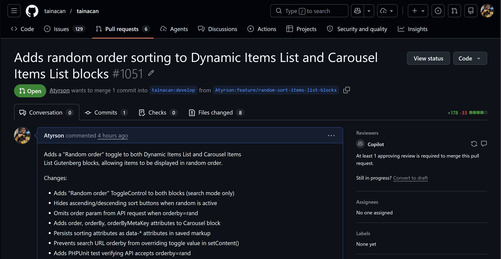

# Diário de Bordo – Sprint 6

## Informações da Sprint

| Item | Descrição |
|------|-----------|
| Sprint | Sprint 6 |
| Data de Início | 19/06/2026 |
| Data de Término | 30/06/2026 |
| Responsável | Atyrson Souto |

---

## Objetivo da Sprint

Esta sprint foi dedicada à **fase de revisão de código** da Pull Request [**#1051 – Adds random order sorting to Dynamic Items List and Carousel Items List blocks**](https://github.com/tainacan/tainacan/pull/1051), submetida na sprint anterior. O foco principal foi analisar o feedback recebido do mantenedor do Tainacan e do Copilot AI, compreender cada apontamento e traçar o plano de correções necessário para que a PR seja aprovada e mesclada ao repositório oficial.

---

## Planejamento e Atividades da Sprint

O trabalho consistiu em ler cada comentário da revisão, verificar o código apontado, entender a raiz do problema e documentar a solução proposta para cada caso.

| Atividade | Status |
|-----------|--------|
| Analisar o feedback do mantenedor (mateuswetah) na PR #1051 | ✔️ |
| Analisar os 5 comentários do Copilot AI na PR #1051 | ✔️ |
| Compreender o conceito de depreciação de blocos Gutenberg (deprecated.js) | ✔️ |
| Mapear soluções para cada apontamento | ✔️ |
| Revisar código-fonte dos arquivos envolvidos para validar os apontamentos | ✔️ |

---

## Ferramentas e Tecnologias Utilizadas

| Ferramenta / Tecnologia | Finalidade |
|--------------------------|------------|
| **GitHub (Pull Requests)** | Acompanhamento dos comentários e interação com o mantenedor |
| **VS Code** | Análise do código-fonte dos arquivos envolvidos |
| **WordPress Developer Documentation** | Consulta sobre o mecanismo de depreciação de blocos Gutenberg |

---

## Atividades Realizadas em Detalhes

### 1. Contextualização e recebimento da revisão

A PR #1051, que implementa a ordenação aleatória nos blocos Dynamic Items List e Carousel Items List, recebeu feedback do mantenedor **mateuswetah** e da ferramenta **Copilot AI**. O mantenedor validou que o código funciona corretamente em seus testes, mas solicitou alterações antes do merge.



### 2. Análise do feedback do mantenedor

O mantenedor destacou que a complexidade da tarefa foi maior do que aparentava inicialmente, especialmente devido à adição de lógica de ordenação ao bloco Carousel (que antes não possuía esses atributos) e ao tratamento de remoção do campo `order` quando `orderby=rand`. Sobre os comentários do Copilot, o mantenedor orientou que a maioria deveria ser considerada, com exceção do último (sobre extrair um helper compartilhado para a lógica de sorting), que ele considerou não necessário no momento.

### 3. Pedido crítico: Depreciação de bloco (`deprecated.js`)

O apontamento mais importante veio diretamente do mantenedor. Ao adicionar três novos atributos ao `block.json` do Carousel Items List (`order`, `orderBy`, `orderByMetaKey`) e novos `data-*` no `save.js`, blocos que foram inseridos em páginas antes desta alteração passam a apresentar erro de validação no editor, pois o WordPress detecta que o markup salvo não corresponde aos atributos esperados.

A solução exigida é adicionar uma nova entrada no array do arquivo `deprecated.js`, contendo o estado anterior dos atributos, `supports` e da função `save` — sem os três novos campos. Isso instrui o editor Gutenberg a reconhecer e migrar automaticamente os blocos antigos, sem quebra de layout.

O mantenedor incluiu capturas de tela mostrando o erro que ocorre quando a depreciação está ausente: o bloco exibe uma mensagem de erro no editor e o console do navegador reporta um número incorreto de atributos esperados.

**Arquivo a ser modificado:** `src/views/gutenberg-blocks/blocks/carousel-items-list/deprecated.js`

**Solução proposta:**

- Copiar o objeto atual de `attributes`, `supports` e `save` (antes da adição dos três novos atributos) do último registro de depreciação;
- Criar uma nova entrada no início do array de depreciações com esses valores, garantindo que os atributos `order`, `orderBy` e `orderByMetaKey` **não** estejam presentes;
- A função `save` dessa entrada de depreciação também não deve conter os `data-order`, `data-order-by` e `data-order-by-meta-key` no markup.

### 4. Análise dos comentários do Copilot AI

O Copilot AI gerou 5 comentários em arquivos distintos. Abaixo, a análise de cada um:

#### C1 – Condição permissiva em `theme.vue`

**Arquivo:** `src/views/gutenberg-blocks/blocks/carousel-items-list/theme.vue`

O código atual verifica apenas `this.order != undefined` antes de setar `queryObject.order`. Porém, `theme.js` inicializa `order` como `''` (string vazia). Isso significa que, mesmo quando nenhuma ordenação foi configurada, uma string vazia pode ser enviada ao parâmetro `order` da API.

**Solução proposta:** Incluir verificação adicional para string vazia:

```javascript
if (this.order != undefined && this.order !== '' && this.orderBy !== 'rand')
    queryObject.order = this.order;
```

#### C2 – `orderByMetaKey` não aplicado no `theme.vue`

**Arquivo:** `src/views/gutenberg-blocks/blocks/carousel-items-list/theme.vue`

O atributo `orderByMetaKey` foi adicionado ao `block.json`, ao `save.js` (como `data-order-by-meta-key`) e ao `theme.js` (que lê e expõe como `this.orderByMetaKey`). No entanto, `theme.vue` nunca aplica esse valor ao `queryObject.metakey`. Isso significa que modos de ordenação que dependem de uma chave de metadado (ex.: ordenar por um campo customizado) não funcionarão no frontend do bloco Carousel.

**Solução proposta:** Adicionar a aplicação do `orderByMetaKey`:

```javascript
if (this.orderByMetaKey != undefined && this.orderByMetaKey !== '')
    queryObject.metakey = this.orderByMetaKey;
```

#### C3 – Teste não cobre envio simultâneo de `order` com `orderby=rand`

**Arquivo:** `tests/test-random-sort-blocks.php`

O teste atual apenas verifica que uma requisição com `orderby=rand` retorna status 200 e a quantidade correta de itens. Ele não cobre o principal caso de borda que o código de UI trata explicitamente: o parâmetro `order` deve ser omitido ou ignorado quando `orderby=rand`.

**Solução proposta:** Adicionar um novo caso de teste que envia **ambos** `orderby=rand` e `order` (ex.: `'asc'`) e verifica que a API ainda responde com sucesso, confirmando que a omissão de `order` no frontend é uma medida de segurança e que o backend lida corretamente com a combinação.

#### C4 – Duplicata de C3

Mesmo apontamento de C3 em um thread duplicado no mesmo arquivo. Nenhuma ação adicional além da descrita em C3.

#### C5 – Lógica de ordenação duplicada nos `edit.js`

**Arquivos:** `carousel-items-list/edit.js` e `dynamic-items-list/edit.js`

O Copilot apontou que a lógica de tratamento de `order`/`orderBy`/`orderByMetaKey` com manipulação especial para `rand` é quase idêntica nos dois blocos. A sugestão foi extrair para um helper compartilhado.

O mantenedor explicitamente declarou que **esta sugestão não é necessária no momento**, portanto foi classificada como melhoria futura sem impacto no merge.

---

## Aprendizados e Dificuldades

**Maiores Dificuldades:**

- **Mecanismo de depreciação de blocos Gutenberg:** compreender que alterações no `block.json` e `save.js` de um bloco exigem entradas correspondentes no `deprecated.js` foi um conceito novo. O WordPress valida estritamente o markup salvo contra os atributos declarados, e qualquer divergência resulta em erro no editor.
- **Rastreamento de fluxo de dados entre camadas:** o Carousel Items List tem um pipeline mais complexo que o Dynamic Items List (`block.json` → `edit.js` → `save.js` → `theme.js` → `theme.vue`), e identificar que o `orderByMetaKey` não chegava ao `queryObject` no `theme.vue` exigiu percorrer todos os arquivos da cadeia.

**Aprendizados:**

- **Depreciação como mecanismo de migração:** a cada alteração nos atributos de um bloco, é necessário preservar o estado anterior no `deprecated.js`, permitindo que o editor reconheça blocos antigos e os migre silenciosamente, mantendo compatibilidade retroativa.
- **Valor do feedback de IA:** as sugestões do Copilot identificaram problemas reais que passariam despercebidos em testes manuais básicos (como a ausência do `orderByMetaKey` no query object e a condição permissiva com string vazia).
- **Priorização de feedback:** nem todo comentário de review precisa ser atendido imediatamente. O mantenedor soube filtrar o que era crítico (depreciação) do que era melhoria futura (helper compartilhado), demonstrando pragmatismo no processo de revisão.

---

## Próximos Passos

- Adicionar a entrada de depreciação no `deprecated.js` do Carousel Items List com os atributos, `supports` e `save` antigos (sem `order`, `orderBy`, `orderByMetaKey`).
- Corrigir a condição de `this.order` no `theme.vue` para também verificar string vazia.
- Aplicar `this.orderByMetaKey` no `queryObject.metakey` do `theme.vue`.
- Adicionar caso de teste no PHPUnit que envie `order` e `orderby=rand` simultaneamente.
- Submeter as correções na mesma branch da PR e solicitar nova revisão.

---

## Histórico de Versões

| Versão | Data | Descrição | Autor |
| :----: | :--: | :-------- | :---- |
| `1.0` | 01/07/2026 | Criação do Diário de Bordo da Sprint 6 | [Atyrson Souto](https://github.com/Atyrson) |
