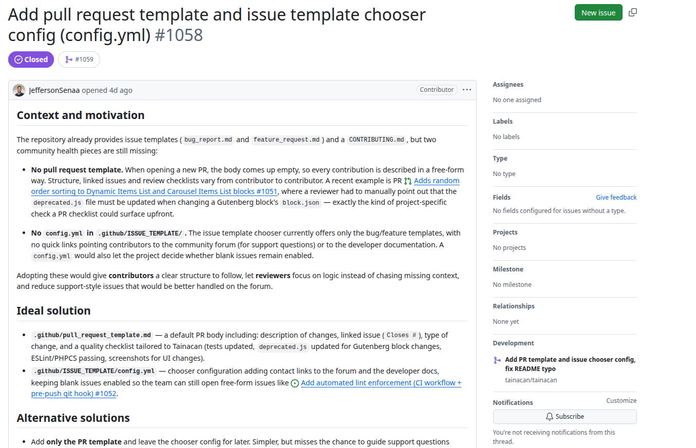
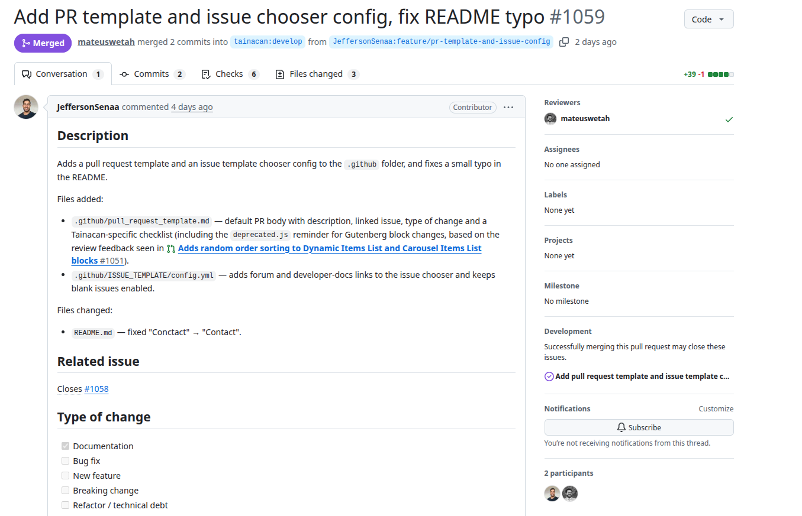

# Diário de Bordo – Sprint 6

## Informações da Sprint

| Item            | Descrição                  |
|-----------------|----------------------------|
| Sprint          | Sprint 6                   |
| Data de Início  | 19/06/2026                 |
| Data de Término | 30/06/2026                 |
| Responsável     | Jefferson Sena Oliveira    |

---

## Objetivo da Sprint

Dar continuidade e concluir a contribuição de **community health** iniciada na [Sprint 5](../Sprint-5/Diario_de_Bordo_Jefferson.md): acompanhar a revisão dos mantenedores no [**PR #1059**](https://github.com/tainacan/tainacan/pull/1059) (que resolve a [**issue #1058**](https://github.com/tainacan/tainacan/issues/1058)), responder a eventuais ajustes solicitados e ter a contribuição aprovada e mesclada ao repositório oficial do Tainacan.

O PR entrega três melhorias que faltavam no projeto:

1. **Template de Pull Request** (`.github/pull_request_template.md`) — padroniza a descrição, a issue vinculada, o tipo de mudança e o checklist de qualidade das PRs.
2. **Configuração do seletor de issue templates** (`.github/ISSUE_TEMPLATE/config.yml`) — direciona contribuidores ao fórum da comunidade e à documentação de desenvolvimento.
3. **Correção de typo no README.md** (`"Conctact"` → `"Contact"`).

---

## Planejamento e Atividades da Sprint

| Atividade | Status |
|-----------|--------|
| Acompanhar a revisão do [**PR #1059**](https://github.com/tainacan/tainacan/pull/1059) pelos mantenedores | ✔️ |
| Avaliar o feedback do revisor e verificar necessidade de ajustes | ✔️ |
| Ter o PR aprovado pelo mantenedor responsável | ✔️ |
| PR mesclado na branch `develop` do repositório oficial | ✔️ |
| Issue [**#1058**](https://github.com/tainacan/tainacan/issues/1058) encerrada com a resolução | ✔️ |

> Legenda de status: ⬜ Pendente · 🔄 Em andamento · ✔️ Concluído

---

## Ferramentas e Tecnologias Utilizadas

| Ferramenta / Tecnologia | Finalidade |
|-------------------------|------------|
| **Git / GitHub (Issues e Pull Requests)** | Acompanhamento da revisão, aprovação e merge do PR |
| **Documentação GitHub (_community health files_)** | Referência para PR templates e `ISSUE_TEMPLATE/config.yml` |
| **VS Code** | Edição dos arquivos de template e configuração |

---

## Atividades Realizadas em Detalhes

### 1. Acompanhamento da revisão

Após a abertura do [PR #1059](https://github.com/tainacan/tainacan/pull/1059) na Sprint 5, o foco desta sprint foi acompanhar a revisão dos mantenedores. O revisor **@mateuswetah** avaliou a contribuição, aprovou as mudanças e a descreveu como *"a good quality-of-life proposal"*, sugerindo apenas possíveis melhorias futuras na abrangência do checklist — sem solicitar alterações bloqueantes para o merge.

### 2. Aprovação e merge

Com o parecer positivo, o [PR #1059](https://github.com/tainacan/tainacan/pull/1059) foi **aprovado e mesclado** na branch `develop` do repositório oficial do Tainacan, encerrando automaticamente a [issue #1058](https://github.com/tainacan/tainacan/issues/1058) por meio da referência `Closes #1058`. A partir de agora, novas Pull Requests do projeto passam a carregar o template padronizado, e o seletor de issues direciona contribuidores aos canais de suporte adequados.

---

## Aprendizados e Dificuldades

**Maiores Dificuldades:**

- **Aguardar o tempo de revisão da comunidade**: o ciclo de aprovação depende da disponibilidade dos mantenedores, exigindo acompanhamento sem pressionar o processo.
- **Preparar o PR para ser aprovado sem retrabalho**: por ter estruturado bem a issue e a descrição do PR desde a Sprint 5, a revisão fluiu sem a necessidade de ajustes bloqueantes.

**Aprendizados:**

- Como é o ciclo completo de uma contribuição open-source aceita: da abertura da issue ao merge, passando pela revisão e aprovação de um mantenedor.
- O valor do feedback de um revisor experiente (@mateuswetah), inclusive das sugestões de melhoria futura que não impedem o merge, mas apontam evolução para o template.
- Que contribuições de _community health_ e documentação, mesmo sendo pequenas em código, têm impacto duradouro no fluxo de trabalho e na qualidade das próximas contribuições do projeto.

---

## Próximos Passos

- Monitorar o uso do novo template de PR e do `config.yml` pelos próximos contribuidores.
- Avaliar, futuramente, as sugestões do revisor sobre a abrangência do checklist do PR template, possivelmente em uma nova contribuição.

---

## Histórico de Versões

| Versão |    Data    | Descrição                              | Autor |
| :----: | :--------: | :------------------------------------- | :---- |
| `1.0`  | 30/06/2026 | Criação do Diário de Bordo da Sprint 6 | [Jefferson Sena Oliveira](https://github.com/jeffersonsenaa) |
