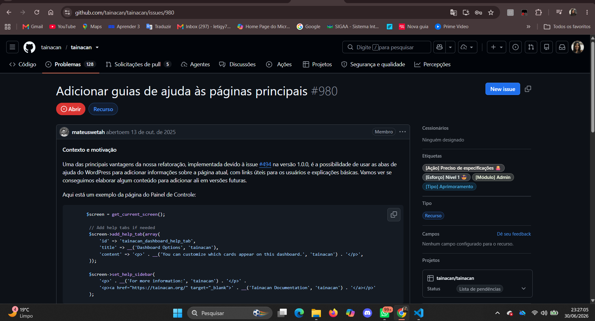
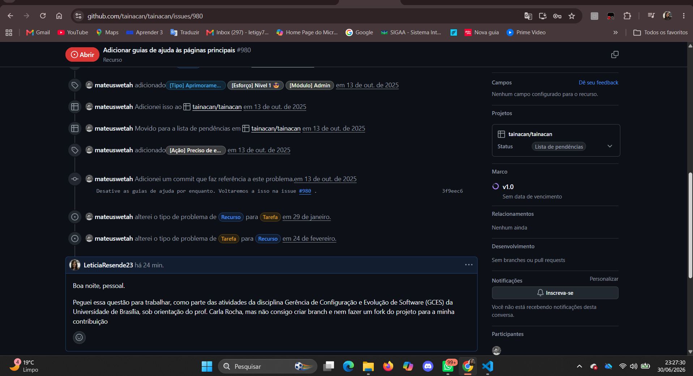
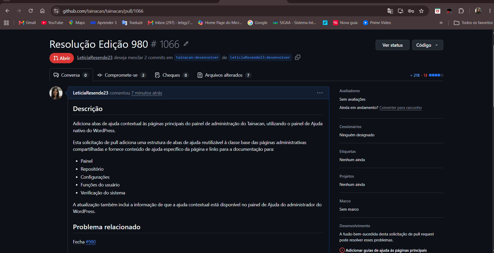
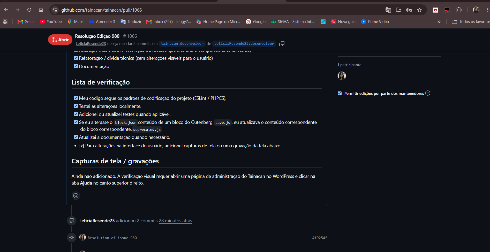
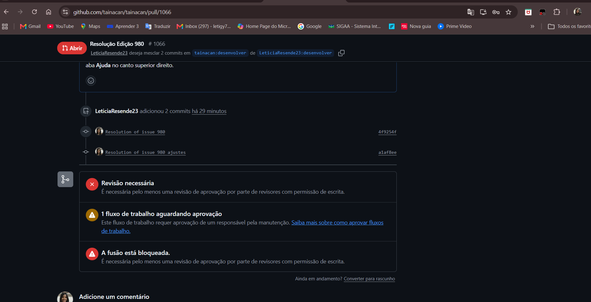
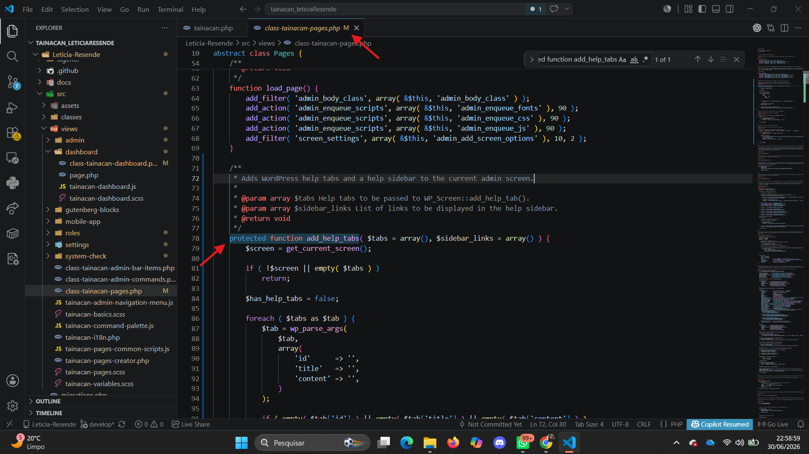
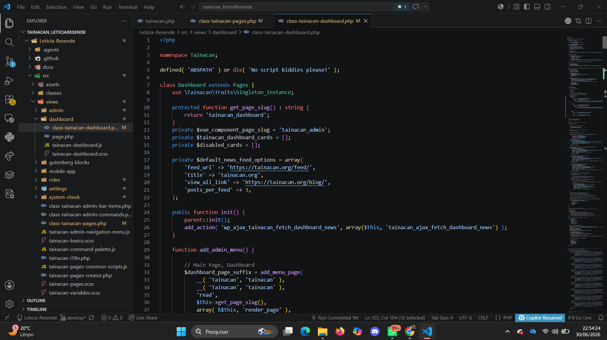
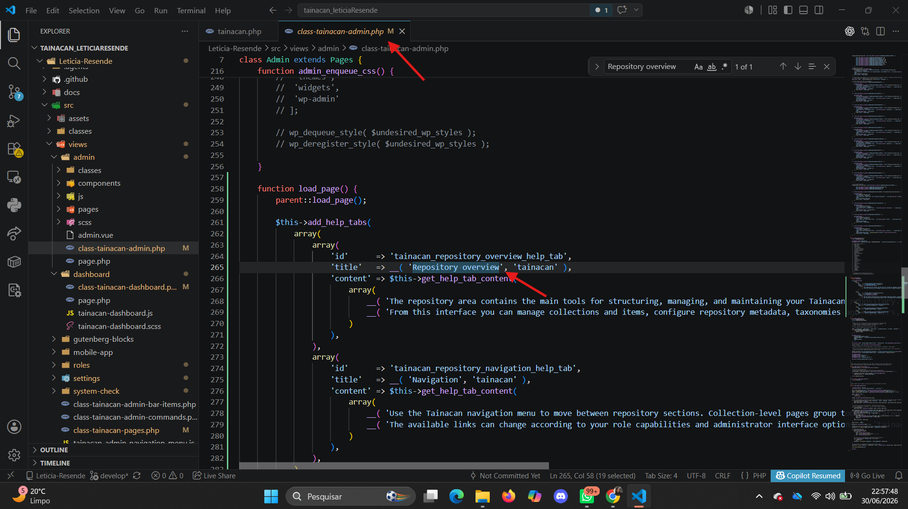
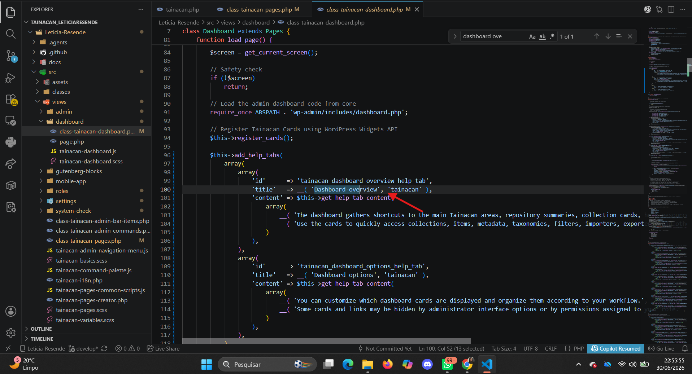
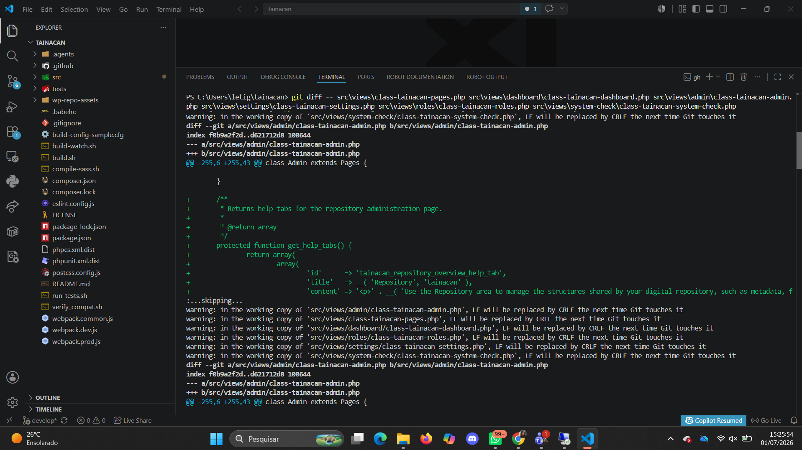

# Diário de Bordo - Letícia Resende

## Informações da Sprint

| Item | Descrição |
|---|---|
| Sprint | Sprint 6 |
| Data de Início | 19/06/2026 |
| Data de Término | 28/06/2026 |
| Responsável | Letícia Resende |
| Issue | [#980 - Adicionar guias de ajuda às páginas principais](https://github.com/tainacan/tainacan/issues/980) |
| Repositório | Tainacan |

---

## Resumo da Sprint

Nesta sprint, o foco principal foi a análise, implementação e validação da Issue [#980 - Adicionar guias de ajuda às páginas principais](https://github.com/tainacan/tainacan/issues/980), relacionada ao módulo administrativo do Tainacan.

A issue tinha como objetivo aproveitar a refatoração feita anteriormente no projeto para adicionar abas de ajuda do WordPress nas páginas principais do painel administrativo do Tainacan. Essas abas permitem exibir explicações básicas sobre a página atual, links úteis para documentação e informações de apoio aos usuários.

Durante a implementação, foram adicionadas guias de ajuda para páginas principais como Dashboard, Repository, Settings, User Roles e System Check. Também foi criado um método reutilizável na classe base das páginas administrativas, permitindo que novas abas de ajuda sejam adicionadas de forma padronizada em outras telas no futuro.

A contribuição foi registrada na Pull Request [#1066 - Resolução Edição 980](https://github.com/tainacan/tainacan/pull/1066), enviada da branch `desenvolver` do fork de Letícia Resende para a branch `develop` do repositório principal do Tainacan. A PR recebeu 2 commits e apresentou 218 adições e 13 exclusões.

No momento da consulta, a PR ainda estava aguardando revisão e aprovação, com a fusão bloqueada pela necessidade de pelo menos uma revisão aprovada.

### Issue 980 

---

## Pull Request

**Pull Request #1066 - Resolução Edição 980**

- [PR 1066 no GitHub](https://github.com/tainacan/tainacan/pull/1066)
- 2 commits: `4f9254f` - `Resolution of issue 980` e `a1af8ee` - `Resolution of issue 980 ajustes`
- 218 adições e 13 exclusões em 7 arquivos alterados
- Revisão necessária antes do merge
- Fusão bloqueada aguardando aprovação de pelo menos um revisor com permissão de escrita

---

## Atividades Realizadas

| Atividade | Tipo | Referência | Status |
|---|---|---|---|
| Leitura e interpretação da Issue #980 | Análise | GitHub Issue #980 | Concluído |
| Identificação das páginas principais do admin do Tainacan | Análise | `src/views` | Concluído |
| Localização do trecho onde as abas de ajuda haviam sido comentadas | Análise | `class-tainacan-dashboard.php` | Concluído |
| Criação de método reutilizável para adicionar abas de ajuda | Desenvolvimento | `class-tainacan-pages.php` | Concluído |
| Criação de método auxiliar para conteúdo das abas | Desenvolvimento | `class-tainacan-pages.php` | Concluído |
| Criação de método auxiliar para sidebar de links de ajuda | Desenvolvimento | `class-tainacan-pages.php` | Concluído |
| Adição de abas de ajuda na página Dashboard | Desenvolvimento | `class-tainacan-dashboard.php` | Concluído |
| Adição de abas de ajuda na página Repository | Desenvolvimento | `class-tainacan-admin.php` | Concluído |
| Adição de abas de ajuda na página Settings | Desenvolvimento | `class-tainacan-settings.php` | Concluído |
| Adição de abas de ajuda na página User Roles | Desenvolvimento | `class-tainacan-roles.php` | Concluído |
| Adição de abas de ajuda na página System Check | Desenvolvimento | `class-tainacan-system-check.php` | Concluído |
| Comparação com o arquivo `tainacan-develop.zip` fornecido como base | Validação | Projeto local | Concluído |
| Verificação visual pelo VS Code usando busca nos arquivos | Validação | VS Code | Concluído |
| Submissão da Pull Request #1066 | Git/GitHub | PR no repositório Tainacan | Concluído |

---

## Maiores Avanços

### Implementação de guias de ajuda nas páginas principais

Foram adicionadas abas de ajuda às principais páginas administrativas do Tainacan. Essas abas explicam o objetivo de cada tela e ajudam o usuário a entender melhor as funcionalidades disponíveis.

As páginas contempladas foram:

- Dashboard
- Repository
- Settings
- User Roles
- System Check

### Criação de estrutura reutilizável

Foi implementado um método reutilizável chamado `add_help_tabs()` na classe base `Pages`, localizada em:

`src/views/class-tainacan-pages.php`

Essa estrutura evita repetição de código e facilita a adição de novas abas de ajuda em outras páginas do sistema.

### Inclusão de links úteis

Além das abas com explicações, foram adicionados links de apoio na sidebar de ajuda, apontando para materiais como documentação, Wiki e fórum da comunidade Tainacan.

---

## Issue Resolvida

**Função `add_help_tabs()` criada em `class-tainacan-pages.php`**

**Aba de ajuda adicionada ao Dashboard**

**Arquivos modificados no Source Control do VS Code**

** Busca no VS Code por `Dashboard overview` ou `Repository overview`**

---

## Maiores Dificuldades

### Dificuldade com comandos no terminal

Durante a validação, alguns comandos sugeridos não funcionaram corretamente no ambiente local. Por exemplo, o comando `rg` não estava disponível, pois a ferramenta ripgrep não estava instalada ou configurada no PATH do sistema.

Como alternativa, a verificação foi feita visualmente pelo VS Code, usando a busca global e a análise dos arquivos modificados.

### Validação sem ambiente WordPress completo

A forma ideal de validar essa issue seria executar o plugin dentro de uma instalação WordPress e abrir o painel **Ajuda/Help** nas páginas do Tainacan. Porém, a validação mais simples disponível foi feita diretamente no código e no editor, confirmando a presença das funções e textos adicionados.

---

## Aprendizados

### Uso das abas de ajuda do WordPress

A atividade permitiu entender melhor como o WordPress permite adicionar conteúdos de ajuda em telas administrativas por meio de métodos como:

`$screen->add_help_tab()`

`$screen->set_help_sidebar()`

Esses recursos são úteis para melhorar a experiência do usuário dentro do painel administrativo.

### Organização de código reutilizável

Foi possível perceber a importância de centralizar comportamentos comuns em uma classe base. Ao criar métodos reutilizáveis em `class-tainacan-pages.php`, a implementação ficou mais organizada e fácil de manter.

### Leitura da arquitetura do Tainacan

A issue ajudou a compreender melhor como o Tainacan organiza suas páginas administrativas dentro da pasta:

`src/views`

Também foi possível identificar como cada página registra seus menus, carrega seus assets e executa lógica específica durante o carregamento da tela.

### Importância do fluxo Git/GitHub

Mesmo sem conseguir concluir o fork ou a criação da branch, a atividade mostrou a importância desse fluxo para contribuições em projetos open source. Criar uma branch, versionar as alterações e abrir uma Pull Request são etapas importantes para que a contribuição seja revisada e integrada ao projeto oficial.

---

## Histórico de Versões

| Versão | Data | Descrição | Autor(es) |
|---|---|---|---|
| 1.0 | 28/06/2026 | Criação do Diário de Bordo da Sprint 6 referente à Issue #980 | [Letícia Resende](https://github.com/LeticiaResende23) |
