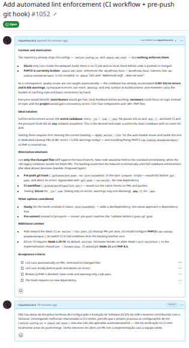

# Diário de Bordo – Sprint 6

## Informações da Sprint

| Item              | Descrição                |
|-------------------|-------------------------|
| Sprint            | Sprint 6                |
| Data de Início    | 19/06/2026              |
| Data de Término   | 30/06/2026              |
| Responsável       | Raquel Eucaria          |

---

## Objetivo da Sprint

Dando continuidade ao trabalho iniciado na [Sprint 5](../Sprint-5/Diario_de_Bordo_Raquel.md), meu objetivo nesta sprint foi amadurecer a proposta de melhoria na esteira de qualidade do projeto — o enforcement automático de lint (ESLint/PHPCS) documentado na issue [tainacan#1052](https://github.com/tainacan/tainacan/issues/1052). A proposta previa duas frentes de implementação (o workflow de CI e o hook de `pre-push`), que **permaneceram em aberto**. A equipe mantenedora respondeu à issue dentro do prazo; o atraso foi de minha parte, pois não consegui desenvolver as duas tarefas dentro do tempo da sprint — por isso a implementação ficará para ser concluída posteriormente. Diante disso, direcionei o esforço para deixar o problema bem mapeado e documentado, de modo que **novos contribuidores** (ou eu mesma, mais adiante) possam pegar a issue e avançar na implementação sem precisar redescobrir todo o contexto.

---

## Planejamento e Atividades da Sprint

Na Sprint 5 abri a issue propondo o enforcement de lint. A equipe mantenedora deu retorno dentro do prazo, mas ao longo desta sprint eu não consegui avançar na implementação a tempo — o atraso foi meu. Para que o esforço já investido não se perdesse, priorizei consolidar o diagnóstico: detalhar o problema, as ferramentas envolvidas e um caminho incremental de solução, transformando a issue em um ponto de partida claro para quem for assumir a tarefa (as duas frentes de implementação seguem em aberto para desenvolvimento posterior).

| Atividade | Status |
|----------|--------|
| Acompanhar a issue e o retorno da equipe em [tainacan#1052](https://github.com/tainacan/tainacan/issues/1052) | ✔️ |
| Detalhar o problema de qualidade de código (backlog de lint e PHPCS quebrado) | ✔️ |
| Documentar solução ideal e alternativa incremental para orientar contribuidores | ✔️ |
| Deixar a issue preparada para ser assumida por novos contribuidores | ✔️ |
| Implementar o workflow de CI de lint | ⬜ |
| Implementar o hook de `pre-push` de lint | ⬜ |

> Legenda de status: ⬜ Pendente · 🔄 Em andamento · ✔️ Concluído

---

## Ferramentas e Tecnologias Utilizadas

| Ferramenta / Tecnologia | Finalidade |
|-----------|-----------|
| **GitHub (Issues)** | Acompanhamento e refinamento da issue de melhoria no repositório oficial do Tainacan |
| **ESLint** | Lint de arquivos `.js`/`.vue` (falha apenas em erros; warnings permanecem não bloqueantes) |
| **PHPCS / `php -l`** | Verificação de padrões e sintaxe dos arquivos `.php` |
| **GitHub Actions** | Esteira de CI prevista para rodar o lint em PRs e pushes |
| **Git hooks (`core.hooksPath`)** | Hook de `pre-push` para validar o lint localmente antes do envio, sem novas dependências |

---

## Atividades Realizadas em Detalhes

**1. Acompanhamento da issue e status da implementação:**
Ao longo da sprint acompanhei a issue [tainacan#1052](https://github.com/tainacan/tainacan/issues/1052), aberta na Sprint 5. A equipe mantenedora respondeu dentro do prazo; o que não avançou foi a minha parte — não consegui desenvolver as duas frentes de implementação (workflow de CI e hook de `pre-push`) dentro do tempo da sprint. Registro isso de forma transparente: o atraso foi meu, e a implementação ficará para ser concluída após o encerramento da disciplina.

**2. Consolidação do diagnóstico para novos contribuidores:**
Como a implementação ficou pendente, o foco desta sprint foi garantir que o problema esteja bem documentado. A issue reúne o contexto (configurações de lint existentes, mas não aplicadas), a motivação (cerca de 4.081 erros e 6.926 warnings de ESLint acumulados e o PHPCS quebrado por falta do pacote `wp-coding-standards/wpcs`), a solução ideal (enforcement em todo o código) e uma alternativa incremental (lint apenas dos arquivos alterados, com hook de `pre-push` via `core.hooksPath` e workflow de CI). Dessa forma, um **novo contribuidor** consegue entender o problema e assumir a implementação a partir de um ponto de partida claro.

---

## Aprendizados e Dificuldades

**Maiores Dificuldades:**

- Gerir o meu tempo dentro da sprint: mesmo com o retorno da equipe dentro do prazo, não consegui concluir as duas frentes de implementação, o que me fez repriorizar as entregas.
- Estruturar a documentação do problema de forma que ele seja compreensível e "assumível" por alguém que não participou da investigação inicial.

**Aprendizados:**

- Nem toda contribuição em projeto open-source se encerra no ciclo previsto; deixar um problema bem mapeado já é, por si só, uma contribuição que reduz a barreira de entrada para outros.
- A importância de documentar contexto, motivação e alternativas de solução para viabilizar a colaboração assíncrona com a comunidade.
- Na prática, a gestão de tempo é tão decisiva quanto a parte técnica: assumir o próprio atraso e deixar o caminho preparado para retomar a implementação depois.

---

## Próximos Passos

- Retomar a implementação após o encerramento da disciplina: desenvolver o hook de `pre-push` e o workflow de CI de lint (inicialmente para os arquivos alterados) e abrir o PR na issue [tainacan#1052](https://github.com/tainacan/tainacan/issues/1052).
- Manter a issue atualizada como referência para novos contribuidores interessados na melhoria de qualidade de código.

---

## Histórico de Versões

| Versão |    Data    | Descrição |            Autor(es)            |
| :----: | :--------: | :-------: | :-----------------------------: |
| `1.0`  | 30/06/2026 | Criação do Diário de Bordo da Sprint 6 | [Raquel Eucaria](https://github.com/raqueleucaria) |
