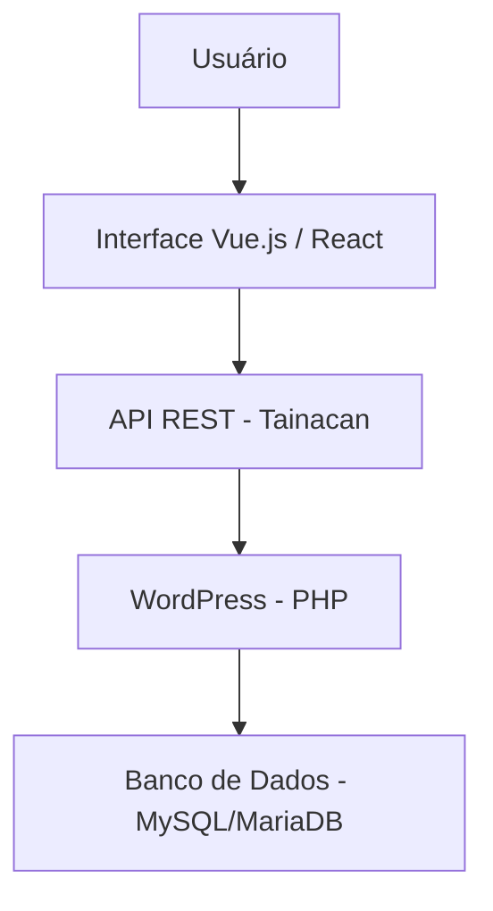

# Arquitetura Tainacan

A arquitetura do Tainacan segue um modelo em camadas, combinando a estrutura consolidada do WordPress com tecnologias modernas de frontend e integração via API REST. Essa abordagem permite alta escalabilidade, flexibilidade e separação de responsabilidades entre interface, lógica de negócio e persistência de dados.

Além disso, o projeto é dividido em diferentes repositórios no GitHub, cada um responsável por uma parte específica do sistema.

---

## **Organização dos Repositórios**

O ecossistema do Tainacan é distribuído principalmente nos seguintes repositórios:

### 🔹 tainacan (Plugin principal)
Repositório central do sistema.

Responsável por:

- Implementação da lógica de negócio
- Estrutura de coleções, itens e metadados
- Integração com o WordPress
- Exposição da API REST

Tecnologias:

```mermaid
- PHP (backend)
- WordPress (CMS base)
```

---

### 🔹 tainacan-interface
Responsável pela interface administrativa do sistema.

Função:

- Gerenciamento visual das coleções
- Criação e edição de itens
- Configuração de metadados e taxonomias

Tecnologias:

```mermaid
- Vue.js
- JavaScript moderno (ES6+)
- Comunicação via API REST
```

---

### 🔹 tainacan-themes
Conjunto de temas utilizados para exibição pública dos dados.

Função:

- Renderização das coleções no frontend
- Customização visual do repositório
- Integração com blocos do WordPress

Tecnologias:

```
- PHP
- HTML/CSS
- React (Gutenberg)
```

---

## **Camada de Aplicação (Backend)**

O backend do Tainacan é implementado como um plugin do WordPress, utilizando PHP como linguagem principal.

### Responsabilidades:

- Gerenciamento de coleções e itens  
- Definição e validação de metadados  
- Controle de permissões e usuários  
- Implementação das regras de negócio  
- Exposição de endpoints REST  

O backend utiliza a infraestrutura do WordPress para:

- Autenticação
- Gerenciamento de usuários
- Persistência de dados

### Banco de Dados

O armazenamento é realizado em:

- **MySQL** ou **MariaDB**

Os dados são estruturados utilizando:

- Tabelas nativas do WordPress
- Custom Post Types (para itens)
- Taxonomias personalizadas
- Metadados armazenados como post meta

Essa abordagem permite compatibilidade total com o ecossistema WordPress.

---

## **Camada de Apresentação (Frontend Administrativo)**

A interface administrativa do Tainacan é construída como uma **Single Page Application (SPA)**, utilizando Vue.js.

### Características:

- Navegação dinâmica sem recarregamento de página  
- Interface altamente interativa  
- Comunicação assíncrona com o backend  
- Atualizações em tempo real via API  

### Funcionamento

O frontend consome a API REST do Tainacan para:

- Criar e editar coleções  
- Gerenciar itens  
- Configurar metadados  
- Aplicar filtros e buscas  

Essa separação entre frontend e backend melhora:

- Performance
- Manutenibilidade
- Escalabilidade do sistema

---

## **Camada de Apresentação (Frontend Público)**

A camada pública é responsável pela exibição dos dados para os usuários finais.

Ela é construída utilizando o próprio WordPress, com suporte a temas e blocos.

### Tecnologias envolvidas:

```
- PHP (renderização server-side)  
- React (blocos Gutenberg)  
- HTML, CSS e JavaScript  
```

### Funcionalidades:

- Exibição de coleções e itens  
- Interface de busca e filtragem  
- Navegação por taxonomias  
- Customização visual via temas  

Essa abordagem permite que o sistema seja facilmente adaptado ao design institucional.

---

## **Camada de Integração**

A comunicação entre todas as camadas ocorre por meio de uma **API RESTful**.

### Responsabilidades:

- Intermediar comunicação entre frontend e backend  
- Padronizar acesso aos dados  
- Permitir integração com sistemas externos  

### Fluxo de Dados




Essa arquitetura desacoplada permite que outros sistemas consumam os dados do Tainacan sem depender diretamente da interface padrão.

---

## Histórico de Versões

| Versão |    Data    | Descrição |            Autor(es)            |
| :----: | :--------: | :-------: | :-----------------------------: |
| `1.0`  | 12/04/2026 |  Criação da pagina conheça o Tainacan    | [Mayara Alves](https://github.com/mayara-tech) |